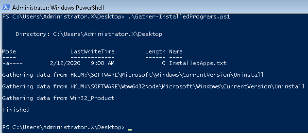
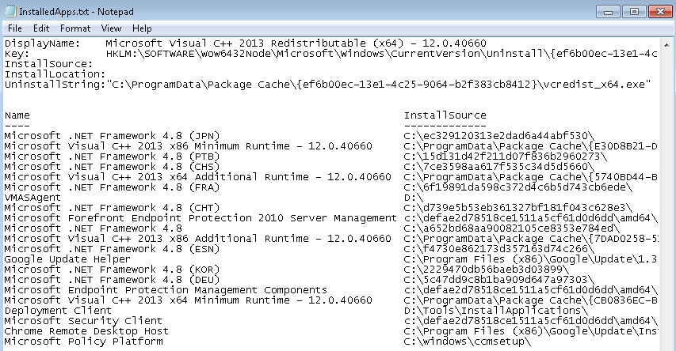

# Gather installed programs

Often we need to gather a list of all installed programs on a system to be able to troubleshoot.

The code generates a file under the current executing user profile desktop ($env:userprofile\Desktop) with the name of InstalledApps.txt with the details retrieved from registry and the WMI class Win32_Product
After being executed, it show the following on screen



The contents of the file will reveal


.
.
.


```powershell
<#
    .NOTES
    ===========================================================================
     Created on:   Feb/12/2020
     Version :     1.0, Initial Release
     Created by:   Vinicio Oses
     Organization: System Center Configuration Manager Costa Rica
     Filename:     Gather-InstalledPrograms.ps1
     ===========================================================================
     .DESCRIPTION
             Often we need to gather a list of all installed programs on a system to be able to troubleshoot.
#>

Function Get {

    Write-Host "`nGathering data from $UninstallKey"

    ForEach ( $Key in $SubKeysFormated ) {
       

        $Obj = ( Get-ItemProperty -Path $Key )

        If ( $Obj.DisplayName -ne $null ) { $DisplayName = ( $Obj.DisplayName ).ToString() } else { $DisplayName = $Obj.DisplayName }
        Add-Content -Path $env:USERPROFILE\Desktop\InstalledApps.txt -Value "DisplayName:`t$DisplayName"

        $KeyPath = $Key.ToString()
        Add-Content -Path $env:USERPROFILE\Desktop\InstalledApps.txt -Value "Key:`t`t$KeyPath"
     
        If ( $Obj.InstallSource -ne $null ) { $InstallSource = ( $Obj.InstallSource ).ToString() } else { $InstallSource = $Obj.InstallSource }
        Add-Content -Path $env:USERPROFILE\Desktop\InstalledApps.txt -Value "InstallSource:`t$InstallSource"
   
        If ( $Obj.InstallLocation -ne $null ) { $InstallLocation = ( $Obj.InstallLocation ).ToString() } else { $InstallLocation = $Obj.InstallLocation }
        Add-Content -Path $env:USERPROFILE\Desktop\InstalledApps.txt -Value "InstallLocation:$InstallLocation"
       
        If ( $Obj.UninstallString -ne $null ) { $UninstallString = ( $Obj.UninstallString ).ToString() } else { $UninstallString = $Obj.UninstallString }
        Add-Content -Path $env:USERPROFILE\Desktop\InstalledApps.txt -Value "UninstallString:$UninstallString`n"
        Add-Content -Path $env:USERPROFILE\Desktop\InstalledApps.txt -Value "" } }

$UninstallKey = "HKLM:\SOFTWARE\Microsoft\Windows\CurrentVersion\Uninstall"
$SubKeys = ( Get-ChildItem -Directory $UninstallKey ).Name
$script:SubKeysFormated = $null; $script:SubKeysFormated = @()
ForEach ( $Key in $SubKeys ) { $Script:SubKeysFormated += $Key -replace "HKEY_LOCAL_MACHINE","HKLM:" }
New-Item -Path $env:USERPROFILE\Desktop -Name InstalledApps.txt -Force

Get

$UninstallKey = "HKLM:\SOFTWARE\Wow6432Node\Microsoft\Windows\CurrentVersion\Uninstall"
$SubKeys = ( Get-ChildItem -Directory $UninstallKey ).Name
$script:SubKeysFormated = $null; $script:SubKeysFormated = @()
ForEach ( $Key in $SubKeys ) { $Script:SubKeysFormated += $Key -replace "HKEY_LOCAL_MACHINE","HKLM:" }

Get

Write-Host "`nGathering data from Win32_Product"

Get-WmiObject -Class Win32_Product | Select-Object Name, InstallSource, InstallLocation | Format-Table | Out-File -FilePath $env:USERPROFILE\Desktop\InstalledApps.txt -Encoding utf8 -Append

Write-Host "`nFinished"
```
