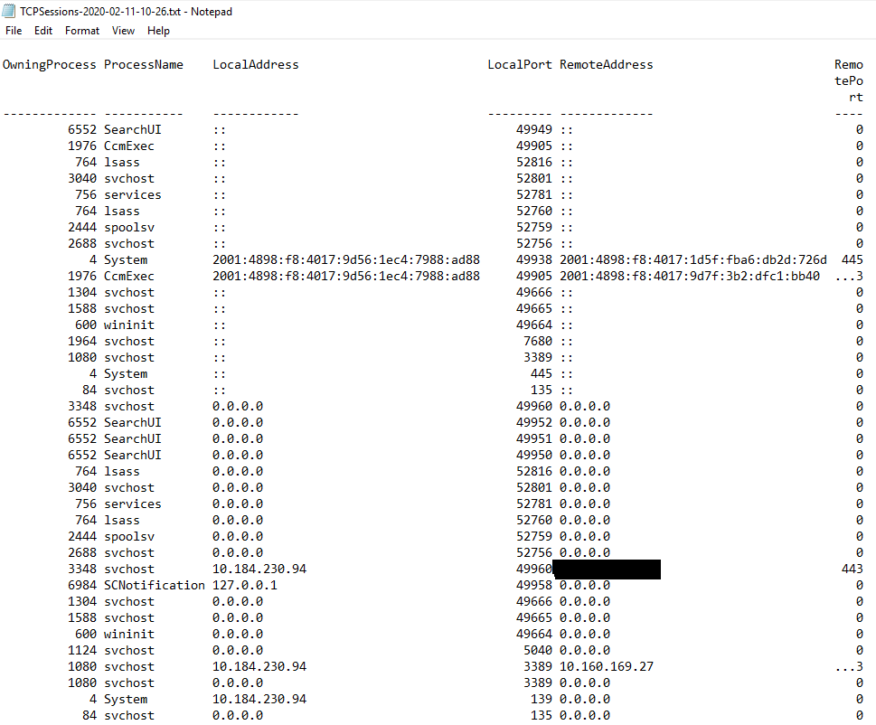

# Get ConfigMgr agent TCP connections

Port exhaustion some times is experienced by our customers causing network and performance degradation.

One of the causes for this issues is process opening TCP connections and not releasing them.

This PowerShell code aims to help engineers to generate a list of all the sessions established by the Config Mgr agent, the same generates a file under C:\Temp\ with the name TCPSessions-yyyy-MM-dd-hh-mm.txt with the report and also checks if the KeepAliveTime registry is in use and also its value (https://docs.microsoft.com/en-us/archive/blogs/nettracer/things-that-you-may-want-to-know-about-tcp-keepalives) (C:\Temp\KeepAliveTime.txt)

This is the output 


And here the content of the file


To leverage this script to contain all TCP sessions and not limit the script to CcmExec.exe process, the script can be modified from:

Line number 1: Write-Host "Will get TCP connections for all process related to CcmExec.exe to check for port exhaustion issues..."

To: Write-Host "Will get all TCP connections for all process to check for port exhaustion issues..."

Line number 7: $Obj | Where-Object { $_.ProcessName -eq "CcmExec" } | Format-Table > $FullFileName

To: $Obj | Format-Table > $FullFileName

The output will change to




```powershell
<#
    .NOTES
    ===========================================================================
     Created on:   Feb/12/2020
     Version :     1.0, Initial Release
     Created by:   Vinicio Oses
     Organization: System Center Configuration Manager Costa Rica
     Filename:     Get-CCMExecTCPConnections.ps1
     ===========================================================================
     .DESCRIPTION
             This PowerShell code aims to help engineers to generate a list of all the 
             sessions established by the Config Mgr agent, the same generates a file 
             under C:\Temp\ with the name TCPSessions-yyyy-MM-dd-hh-mm.txt with the report 
             and also checks if the KeepAliveTime registry is in use and also its 
             value (https://docs.microsoft.com/en-us/archive/blogs/nettracer/things-that-you-may-want-to-know-about-tcp-keepalives) (C:\Temp\KeepAliveTime.txt)
#>

Write-Host "Will get TCP connections for all process related to CcmExec.exe to check for port exhaustion issues..."
If ( ( Test-Path -Path C:\Temp -ErrorAction SilentlyContinue ) -ne $true ) { New-Item -Path C:\ -Name Temp -ItemType Directory -ErrorAction SilentlyContinue -Force }
$Filename = "TCPSessions-"+(Get-Date -Format "yyyy-MM-dd-HH-mm")+".txt"
New-Item -Path "C:\Temp\" -Name "$Filename" -ItemType File  -Force
$FullFileName = "C:\Temp\"+$Filename
$Obj = Get-NetTCPConnection | Select-Object OwningProcess, @{Name="ProcessName";Expression={(Get-Process -PID $_.OwningProcess).ProcessName}}, LocalAddress, LocalPort, RemoteAddress, RemotePort, State
$Obj | Where-Object { $_.ProcessName -eq "CcmExec" } | Format-Table > $FullFileName
Write-Host "`nTCP connections saved to $FullFileName"
If ( Get-ItemProperty -Path HKLM:\SYSTEM\CurrentControlSet\Services\Tcpip\Parameters -Name KeepAliveTime -ErrorAction SilentlyContinue ) {
    Get-ItemProperty -Path HKLM:\SYSTEM\CurrentControlSet\Services\Tcpip\Parameters -Name KeepAliveTime > C:\Temp\KeepAliveTime.txt
    Write-Host "KeepAliveTime info saved to C:\Temp\KeepAliveTime.txt" }
Else { Write-Host "KeepAliveTime reg key not in use" }
```
