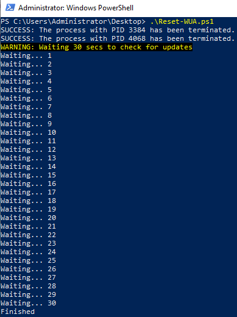

# Reset Windows Update Agent

Some times updates do not install because the Windows Update Agent is broken so we would reset with agent as part of troubleshooting, this script automates that process

This is a standard procedure for troubleshooting updates that are not getting installed

This is how it would like upon success



```powershell
<#
    .NOTES
    ===========================================================================
     Created on:   July/22/2021
     Version:       1.1, Added minor validations
                    1.0, Initial Release
     Created by:   Vinicio Oses
     Organization: System Center Configuration Manager Costa Rica
     Filename:     Reset-WUA.ps1
     ===========================================================================
     .DESCRIPTION
             Some times updates do not install because the Windows Update Agent is broken so 
             we would reset with agent as part of troubleshooting, this script automates that process.
             This is a standard procedure for troubleshooting updates that are not getting installed
#>

$currentPrincipal = New-Object Security.Principal.WindowsPrincipal([Security.Principal.WindowsIdentity]::GetCurrent())
If ( ( $currentPrincipal.IsInRole([Security.Principal.WindowsBuiltInRole]::Administrator) ) -eq $false ) { Write-Warning "PowerShell must be executed as administrator";  Start-Sleep 3 }

Function Timer { Param ( $Seconds, $Legend )

    For( $i = 1; $i -le $Seconds; $i++) { Write-Progress -Activity “$Legend ($Seconds secs).” -status “$i secs...” -percentComplete ($i / $Seconds*100); Start-Sleep -Seconds 1 } }

If ( ( Get-Service -Name BITS ).Status -eq "Running" ) { Stop-Service -Name BITS -Force -Confirm:$False -ErrorAction SilentlyContinue }

$ID = Get-WmiObject -Class Win32_Service -Filter "Name LIKE 'wuauserv'" | Select-Object -ExpandProperty ProcessId

If ( $ID -ne 0 ) { taskkill /pid $ID /F }

Set-Service -Name wuauserv -StartupType Disabled -Confirm:$False -ErrorAction SilentlyContinue

If ( ( Get-Service -Name AppIDSvc ).Status -eq "Running" ) { Stop-Service -Name AppIDSvc -Force -Confirm:$False -ErrorAction SilentlyContinue }

$ID = Get-WmiObject -Class Win32_Service -Filter "Name LIKE 'CryptSvc'" | Select-Object -ExpandProperty ProcessId

If ( $ID -ne 0 ) { taskkill /pid $ID /F }

Set-Service -Name CryptSvc -StartupType Disabled -Confirm:$False -ErrorAction SilentlyContinue

If ( Test-Path -Path $env:SystemRoot\system32\Catroot2 -ErrorAction SilentlyContinue ) { Remove-Item -Path $env:SystemRoot\system32\Catroot2 -Recurse -Force -Confirm:$False -ErrorAction SilentlyContinue }

If ( Test-Path -Path $env:ALLUSERSPROFILE\Microsoft\Network\Downloader -ErrorAction SilentlyContinue ) { Remove-Item -Path $env:ALLUSERSPROFILE\Microsoft\Network\Downloader -Recurse -Force -Confirm:$False -ErrorAction SilentlyContinue }

If ( Test-Path -Path C:\ProgramData\Microsoft\Network\Downloader -ErrorAction SilentlyContinue ) { Remove-Item -Path C:\ProgramData\Microsoft\Network\Downloader -Recurse -Force -Confirm:$False -ErrorAction SilentlyContinue }

If ( Test-Path -Path $env:SystemRoot\SoftwareDistribution -ErrorAction SilentlyContinue ) { Remove-Item -Path $env:SystemRoot\SoftwareDistribution -Recurse -Force -Confirm:$False -ErrorAction SilentlyContinue }

regsvr32.exe /s $env:SystemRoot\System32\atl.dll
regsvr32.exe /s $env:SystemRoot\System32\urlmon.dll
regsvr32.exe /s $env:SystemRoot\System32\mshtml.dll
regsvr32.exe /s $env:SystemRoot\System32\shdocvw.dll
regsvr32.exe /s $env:SystemRoot\System32\browseui.dll
regsvr32.exe /s $env:SystemRoot\System32\jscript.dll
regsvr32.exe /s $env:SystemRoot\System32\vbscript.dll
regsvr32.exe /s $env:SystemRoot\System32\scrrun.dll
regsvr32.exe /s $env:SystemRoot\System32\msxml.dll
regsvr32.exe /s $env:SystemRoot\System32\msxml3.dll
regsvr32.exe /s $env:SystemRoot\System32\msxml6.dll
regsvr32.exe /s $env:SystemRoot\System32\actxprxy.dll
regsvr32.exe /s $env:SystemRoot\System32\softpub.dll
regsvr32.exe /s $env:SystemRoot\System32\wintrust.dll
regsvr32.exe /s $env:SystemRoot\System32\dssenh.dll
regsvr32.exe /s $env:SystemRoot\System32\rsaenh.dll
regsvr32.exe /s $env:SystemRoot\System32\gpkcsp.dll
regsvr32.exe /s $env:SystemRoot\System32\sccbase.dll
regsvr32.exe /s $env:SystemRoot\System32\slbcsp.dll
regsvr32.exe /s $env:SystemRoot\System32\cryptdlg.dll
regsvr32.exe /s $env:SystemRoot\System32\oleaut32.dll
regsvr32.exe /s $env:SystemRoot\System32\ole32.dll
regsvr32.exe /s $env:SystemRoot\System32\shell32dll
regsvr32.exe /s $env:SystemRoot\System32\initpki.dll
regsvr32.exe /s $env:SystemRoot\System32\wuapi.dll
regsvr32.exe /s $env:SystemRoot\System32\wuaueng.dll
regsvr32.exe /s $env:SystemRoot\System32\wuaueng1.dll
regsvr32.exe /s $env:SystemRoot\System32\wucltui.dll
regsvr32.exe /s $env:SystemRoot\System32\wups.dll
regsvr32.exe /s $env:SystemRoot\System32\wups2.dll
regsvr32.exe /s $env:SystemRoot\System32\wuweb.dll
regsvr32.exe /s $env:SystemRoot\System32\qmgr.dll
regsvr32.exe /s $env:SystemRoot\System32\qmgrprxy.dll
regsvr32.exe /s $env:SystemRoot\System32\wucltux.dll
regsvr32.exe /s $env:SystemRoot\System32\muweb.dll
regsvr32.exe /s $env:SystemRoot\System32\wuwebv.dll

If ( Get-ItemProperty -Path HKLM:\SOFTWARE\Microsoft\Windows\CurrentVersion\WindowsUpdate -Name SusClientId -ErrorAction SilentlyContinue ) { Remove-ItemProperty -Path HKLM:\SOFTWARE\Microsoft\Windows\CurrentVersion\WindowsUpdate -Name SusClientId -ErrorAction SilentlyContinue -Force -Confirm:$False }

If ( Get-ItemProperty -Path HKLM:\SOFTWARE\Microsoft\Windows\CurrentVersion\WindowsUpdate -Name SusClientIdValidation -ErrorAction SilentlyContinue ) { Remove-ItemProperty -Path HKLM:\SOFTWARE\Microsoft\Windows\CurrentVersion\WindowsUpdate -Name SusClientIdValidation -ErrorAction SilentlyContinue -Force -Confirm:$False }

If ( Get-ItemProperty -Path HKLM:\SOFTWARE\Microsoft\Windows\CurrentVersion\WindowsUpdate -Name AccountDomainSid -ErrorAction SilentlyContinue ) { Remove-ItemProperty -Path HKLM:\SOFTWARE\Microsoft\Windows\CurrentVersion\WindowsUpdate -Name AccountDomainSid -ErrorAction SilentlyContinue -Force -Confirm:$False }

If ( Get-ItemProperty -Path HKLM:\SOFTWARE\Microsoft\Windows\CurrentVersion\WindowsUpdate -Name PingID -ErrorAction SilentlyContinue ) { Remove-ItemProperty -Path HKLM:\SOFTWARE\Microsoft\Windows\CurrentVersion\WindowsUpdate -Name PingID -ErrorAction SilentlyContinue -Force -Confirm:$False }

If ( Test-Path -Path $env:SystemRoot\Logs\WindowsUpdate -ErrorAction SilentlyContinue ) { Remove-Item -Path $env:SystemRoot\Logs\WindowsUpdate -Recurse -Force -Confirm:$False -ErrorAction SilentlyContinue }

If ( Test-Path -Path $env:SystemRoot\WindowsUpdate.log -ErrorAction SilentlyContinue ) { Remove-Item -Path $env:SystemRoot\WindowsUpdate.log -Recurse -Force -Confirm:$False }

Start-Service -Name BITS -Confirm:$False -ErrorAction SilentlyContinue

Set-Service -Name wuauserv -StartupType Automatic -Confirm:$False -ErrorAction SilentlyContinue

Start-Service -Name wuauserv -Confirm:$False -ErrorAction SilentlyContinue

Start-Service -Name AppIDSvc -Confirm:$False -ErrorAction SilentlyContinue

Set-Service -Name CryptSvc -StartupType Manual -Confirm:$False -ErrorAction SilentlyContinue

Start-Service -Name CryptSvc -Confirm:$False -ErrorAction SilentlyContinue

Wuauclt /resetauthorization /detectnow

Wuauclt /detectnow /reportnow

Write-Host "Finished"

$CheckForUpdates = Read-Host "Do you want to check for updates now?(y/n) "

$CheckForUpdates = $CheckForUpdates.ToLower()

If ( $CheckForUpdates -eq "n" ) { Write-Host "Will not check for updates" }
ElseIf ( $CheckForUpdates -eq "y" ) { Timer -Seconds 30 -Legend "Waiting 30 secs to check for updates"; Wuauclt /updatenow }
ElseIf ( ( $CheckForUpdates -ne "y" ) -or ( $CheckForUpdates -ne "n" ) ) { Write-Host "Option invalid, will not check for updates" }
```
