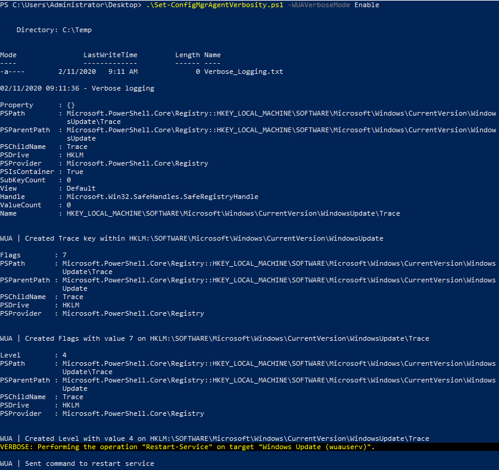
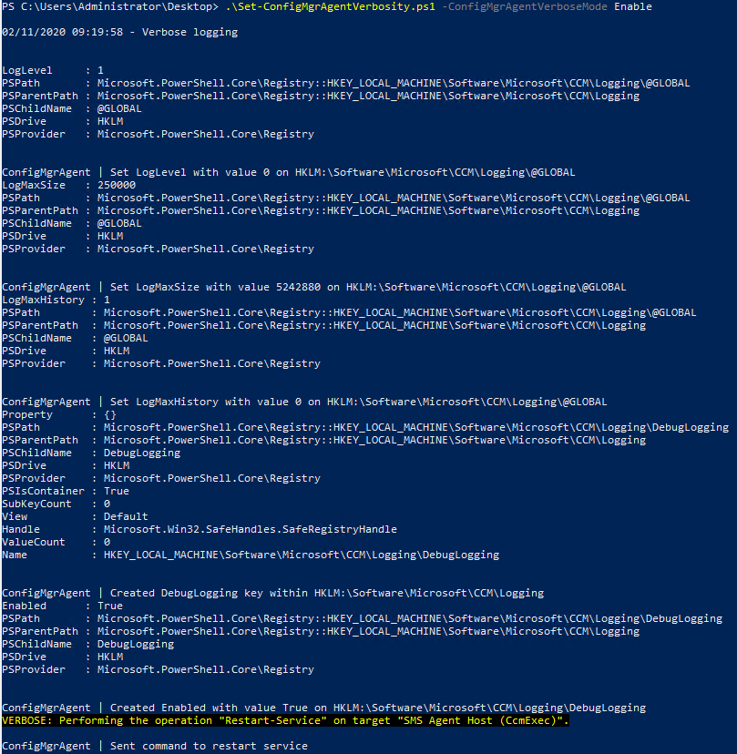
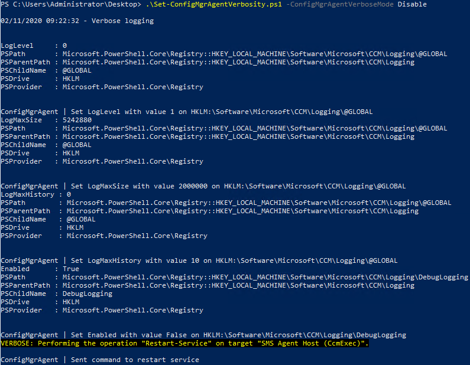

# Enable and disable verbose logging for Windows Update Agent (WUA), Config Mgr Agent and Component-Based Servicing (CBS)

Engineers need to enable verbose logging on these components to see further data in order to continue troubleshooting, this script ease that process through PowerShell automation.

For the following sample, we have copied and pasted the code and named the file as Set-ConfigMgrAgentVerbosity.ps1

To enable verbose logging on Windows Update Agent (WUA) run: .\Set-ConfigMgrAgentVerbosity.ps1 -WUAVerboseMode Enable
To enable verbose logging on Config Mgr Agent run: .\Set-ConfigMgrAgentVerbosity.ps1 -ConfigMgrAgentVerboseMode Enable
To enable verbose logging on Component-Based Servicing (CBS) run: .\Set-ConfigMgrAgentVerbosity.ps1 -CBSVerboseMode Enable

To disable verbose logging on Windows Update Agent (WUA) run: .\Set-ConfigMgrAgentVerbosity.ps1 -WUAVerboseMode Disable
To disable verbose logging on Config Mgr Agent run: .\Set-ConfigMgrAgentVerbosity.ps1 -ConfigMgrAgentVerboseMode Disable
To disable verbose logging on Component-Based Servicing (CBS) run: .\Set-ConfigMgrAgentVerbosity.ps1 -CBSVerboseMode Disable

This is how it looks like upon a success execution









```powershell
<#
    .NOTES
    ===========================================================================
     Created on:   Feb/12/2020
     Version :     1.0, Initial Release
     Created by:   Vinicio Oses
     Organization: System Center Configuration Manager Costa Rica
     Filename:     Set-ConfigMgrAgentVerbosity.ps1
     ===========================================================================
     .DESCRIPTION
             For the following sample, we have copied and pasted the code and named the file as Set-ConfigMgrAgentVerbosity.ps1

        To enable verbose logging on Windows Update Agent (WUA) run: .\Set-ConfigMgrAgentVerbosity.ps1 -WUAVerboseMode Enable
        To enable verbose logging on Config Mgr Agent run: .\Set-ConfigMgrAgentVerbosity.ps1 -ConfigMgrAgentVerboseMode Enable
        To enable verbose logging on Component-Based Servicing (CBS) run: .\Set-ConfigMgrAgentVerbosity.ps1 -CBSVerboseMode Enable

        To disable verbose logging on Windows Update Agent (WUA) run: .\Set-ConfigMgrAgentVerbosity.ps1 -WUAVerboseMode Disable
        To disable verbose logging on Config Mgr Agent run: .\Set-ConfigMgrAgentVerbosity.ps1 -ConfigMgrAgentVerboseMode Disable
        To disable verbose logging on Component-Based Servicing (CBS) run: .\Set-ConfigMgrAgentVerbosity.ps1 -CBSVerboseMode Disable
#>

#[CmdletBinding(SupportsShouldProcess = $true, ConfirmImpact = 'High')]
 
param(
[Parameter(Mandatory=$False,ValueFromPipeline=$False)][ValidateSet("Enable","Disable")][String]$WUAVerboseMode,
[Parameter(Mandatory=$False,ValueFromPipeline=$False)][ValidateSet("Enable","Disable")][String]$ConfigMgrAgentVerboseMode,
[Parameter(Mandatory=$False,ValueFromPipeline=$False)][ValidateSet("Enable","Disable")][String]$CBSVerboseMode )
 
If ( ( $WUAVerboseMode -eq "" ) -and ( $ConfigMgrAgentVerboseMode -eq "" ) -and ( $CBSVerboseMode -eq "" ) ) { Write-Host "No parameters specified."; break }
 
#Confirm that PowerShell is being executed as administrator
 
$currentPrincipal = New-Object Security.Principal.WindowsPrincipal([Security.Principal.WindowsIdentity]::GetCurrent())
If ( ( $currentPrincipal.IsInRole([Security.Principal.WindowsBuiltInRole]::Administrator) ) -eq $false ) { Write-Warning "PowerShell must be executed as administrator";  Start-Sleep 3 }
 
#Create Temp folder under C:\ in case that it doesnt exist, this to place the log file
 
If ( ( Test-Path C:\Temp ) -eq $false ) { New-Item -Path C:\ -Name Temp -ItemType Directory }
 
#Create log file Verbose_Logging.txt within C:\Temp
 
If ( ( Test-Path -Path C:\Temp\Verbose_Logging.txt ) -eq $False ) { New-Item -Path C:\Temp\ -Name Verbose_Logging.txt -ItemType File -Force }
 
$LogPath = "C:\Temp\Verbose_Logging.txt"
 
#The following function will help to print on screen and also feed the log file
 
Function Output() {
 
    param ( [Parameter(Mandatory=$True,ValueFromPipeline=$True)] [String]$Text )
 
    Write-Host "`n$Text"
    Add-Content -Value "`n$Text" -Path $LogPath }
 
#Get current date
 
$Date = Get-Date
 
#Call the Output function to set a timestamp
 
Output -Text "$Date - Verbose logging"
 
#The following function simplifies how modifications to registry are done
 
Function ModifyKeyValues() {
        param ( [Parameter(Mandatory=$True,ValueFromPipeline=$True)] [String]$Hive,
                [Parameter(Mandatory=$True,ValueFromPipeline=$True)] [String]$Name,
                [Parameter(Mandatory=$True,ValueFromPipeline=$True)] [String]$PropertyType,
                [Parameter(Mandatory=$True,ValueFromPipeline=$True)] [String]$Value,
                [Parameter(Mandatory=$False,ValueFromPipeline=$False)][ValidateSet("WUA","ConfigMgrAgent","CBS")][String]$Log )
   
#Test if the value exists
  Get-ItemProperty -Path $Hive -Name $Name -ErrorAction SilentlyContinue
If ( $? -eq $False) {
 
#If the value doesnt exists then wecreate it and set the value
 
        New-ItemProperty -Path $Hive -Name $Name -PropertyType $PropertyType -Value $Value -Force
        Output -Text "$Log | Created $Name with value $Value on $Hive"
        } Else {
 
        #If the value exists then we change its value
 
        Set-ItemProperty -Path $Hive -Name $Name -Value $Value -Force
        Output -Text "$Log | Set $Name with value $Value on $Hive" } }
 
#Windows Update Agent (WUA) section
 
If ( $WUAVerboseMode -eq "Enable" ) { #First condition evaluates if we want to enable verbose logging
 
#Test if the Trace key exists and we create it in case is not there
 
If ( ( Test-Path HKLM:\SOFTWARE\Microsoft\Windows\CurrentVersion\WindowsUpdate\Trace ) -eq $False ) {
       
        New-Item -Path HKLM:\SOFTWARE\Microsoft\Windows\CurrentVersion\WindowsUpdate -Name Trace -Force
        Output -Text "WUA | Created Trace key within HKLM:\SOFTWARE\Microsoft\Windows\CurrentVersion\WindowsUpdate" }
 
ModifyKeyValues -Hive "HKLM:\SOFTWARE\Microsoft\Windows\CurrentVersion\WindowsUpdate\Trace" -Name Flags -PropertyType DWord -Value 7 -Log WUA
 
ModifyKeyValues -Hive "HKLM:\SOFTWARE\Microsoft\Windows\CurrentVersion\WindowsUpdate\Trace" -Name Level -PropertyType DWord -Value 4 -Log WUA
 
$Control = 0
 
} ElseIf ( $WUAVerboseMode -eq "Disable" ) { #Second condition evaluates if we want to disable verbose logging
If ( ( Test-Path HKLM:\SOFTWARE\Microsoft\Windows\CurrentVersion\WindowsUpdate\Trace ) -eq $True ) {
   
        #Test if the Trace key exists and delete it
 
         Remove-Item -Path HKLM:\SOFTWARE\Microsoft\Windows\CurrentVersion\WindowsUpdate\Trace -Force -Recurse
        Output -Text "WUA | Deleted Trace key from HKLM:\SOFTWARE\Microsoft\Windows\CurrentVersion\WindowsUpdate"
        $Control = 0
} Else {
   
        #Already disabled, no need to do anything else
        Output -Text "WUA | No need to disable since its already off" } }
 
If ( ( ( $WUAVerboseMode -eq "Enable" ) -or ( $WUAVerboseMode -eq "Disable" ) ) -and ( $Control -eq 0 ) ) {
   
    #Restart Windows Update Agent (WUA) for changes to take place
 
    Restart-Service -Name wuauserv -Force -Verbose
    Output -Text "WUA | Sent command to restart service" }
 
#Config Mgr Agent section
 
#Confirm if Config Mgr agent is installed and running
 
If ( Get-Service -Name CcmExec ) {
If ( $ConfigMgrAgentVerboseMode -eq "Enable" ) { #First condition evaluates if we want to enable verbose logging
 
ModifyKeyValues -Hive "HKLM:\Software\Microsoft\CCM\Logging\@GLOBAL" -Name LogLevel -PropertyType DWord -Value 0 -Log ConfigMgrAgent
 
ModifyKeyValues -Hive "HKLM:\Software\Microsoft\CCM\Logging\@GLOBAL" -Name LogMaxSize -PropertyType DWord -Value 5242880 -Log ConfigMgrAgent
 
ModifyKeyValues -Hive "HKLM:\Software\Microsoft\CCM\Logging\@GLOBAL" -Name LogMaxHistory -PropertyType DWord -Value 0 -Log ConfigMgrAgent
 
#Test if the DebugLogging key exists and we create it in case is not there
 
If ( ( Test-Path HKLM:\Software\Microsoft\CCM\Logging\DebugLogging ) -eq $False ) {
       
New-Item -Path HKLM:\Software\Microsoft\CCM\Logging -Name DebugLogging -Force
        Output -Text "ConfigMgrAgent | Created DebugLogging key within HKLM:\Software\Microsoft\CCM\Logging" }
 
ModifyKeyValues -Hive "HKLM:\Software\Microsoft\CCM\Logging\DebugLogging" -Name Enabled -PropertyType String -Value True -Log ConfigMgrAgent
$Control = 0
 
} ElseIf ( $ConfigMgrAgentVerboseMode -eq "Disable" ) { #Second condition evaluates if we want to disable verbose logging
       
ModifyKeyValues -Hive "HKLM:\Software\Microsoft\CCM\Logging\@GLOBAL" -Name LogLevel -PropertyType DWord -Value 1 -Log ConfigMgrAgent
 
ModifyKeyValues -Hive "HKLM:\Software\Microsoft\CCM\Logging\@GLOBAL" -Name LogMaxSize -PropertyType DWord -Value 2000000 -Log ConfigMgrAgent
 
ModifyKeyValues -Hive "HKLM:\Software\Microsoft\CCM\Logging\@GLOBAL" -Name LogMaxHistory -PropertyType DWord -Value 10 -Log ConfigMgrAgent
 
ModifyKeyValues -Hive "HKLM:\Software\Microsoft\CCM\Logging\DebugLogging" -Name Enabled -PropertyType String -Value False -Log ConfigMgrAgent
       
$Control = 0 }
 
If ( ( ( $ConfigMgrAgentVerboseMode -eq "Enable" ) -or ( $ConfigMgrAgentVerboseMode -eq "Disable" ) ) -and ( $Control -eq 0 ) ) {
   
#Restart Config Mgr agent for changes to take place
 
Restart-Service -Name CcmExec -Force -Verbose
Output -Text "ConfigMgrAgent | Sent command to restart service" }
 
} Else { Output -Text "ConfigMgrAgent | Agent not installed or not working properly" }
 
#Component-Based Servicing (CBS) section
 
If ( $CBSVerboseMode -eq "Enable" ) { #First condition evaluates if we want to enable verbose logging
 
#Create the environment variable
   
[Environment]::SetEnvironmentVariable("WINDOWS_TRACING_FLAGS","10000", [System.EnvironmentVariableTarget]::Machine)
 
Output -Text "CBS | Enabled"
 
} ElseIf ( $CBSVerboseMode -eq "Disable" ) { #Second condition evaluates if we want to disable verbose logging
 
#Delete the environment variable
 
[Environment]::SetEnvironmentVariable("WINDOWS_TRACING_FLAGS",$null, [System.EnvironmentVariableTarget]::Machine)
 
Output -Text "CBS | Disabled" }
```
