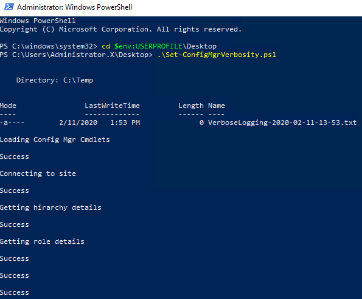

# Change verbosity levels in Config Mgr infrastructure components

Deeper logging levels from Config Mgr components are some times preferred due to the nature of some issues.

This script changes the verbose levels of all Config Mgr On-Premise components with a simple GUI from the CAS or the Primary without the need to remote into any of the other site or system servers.

To properly execute this script you need:

- Run PowerShell as administrator
- Be a full administrator of Configuration Manager
- Run the script from the top of your hierarchy
- The remote site/system server needs to:
  - Be reachable on the network
  - Have PowerShell enabled to accept remote command execution (winrm quickconfig or Enable-PSRemoting)
  - Preferred Domain Admin level of permissions to prevent registry modification failures

Here the flow of the script:

Upon first execution, it will validate that the basic requirements for execution are met, it will let know about any issues on screen and also will log the messages on C:\Temp on a file with the format of VerboseLogging-yyyy-MM-dd-hh-mm.txt



Here the file content


On the GUI we get a summary of the infrastructure ordered from top of the hierarchy to all downstream components 


To start modifying site/server systems, click on the drop down to select a server


Then click on Get


The script has discovered what roles the selected machine has deployed and its current verbosity levels, this way we know if previously any default value has been modified.
To change any values from Default to Verbose or viceversa, just thick the required box and hit Set.
Following the previous screenshot, we will change Console from Verbose to Default, Component "SMS_REPLICATION_CONFIGURATION_MONITOR" from Default to Verbose, Tracing "SMS_REPLICATION_CONFIGURATION_MONITOR" from Default to Verbose and also will enable SQL Tracing


The output window will keep a history of all the actions done but it will not save it anywhere on the logs so please copy/paste its contents for future reference in case required.

There are some components such as SQL for SMS Provider that require to have the SMS Exec restarted in order for verbose logging to kick in or be removed, for such cases, a prompt will be shown on screen. The following sample shows us that we have selected the server SQL1.x.lab and then we clicked Get 


We will go ahead an thick the Verbose option and click Set which gives us the following prompt


If we click Yes, then the service will be restarted, otherwise we will have to remember to restart it manually later on, this is what would get logged on the output


```powershell
<#
    .NOTES
    ===========================================================================
     Created on:   Feb/12/2020
     Version :      1.0, Initial Release
     Created by:   Vinicio Oses
     Organization: System Center Configuration Manager Costa Rica
     Filename:     Set-ConfigMgrVerbosity.ps1
     ===========================================================================
     .DESCRIPTION
             Deeper logging levels from Config Mgr components are some times preferred due to the nature of some issues.
             This script changes the verbose levels of all Config Mgr On-Premise components with a simple GUI from the CAS or the Primary without the need to remote into any of the other site or system servers.
             To properly execute this script you need:
    Run PowerShell as administrator
    Be a full administrator of Configuration Manager
    Run the script from the top of your hierarchy
    The remote site/system server needs to:
    Be reachable on the network
    Have PowerShell enabled to accept remote command execution (winrm quickconfig or Enable-PSRemoting)
    Preferred Domain Admin level of permissions to prevent registry modification failures
#>

$ErrorActionPreference = "SilentlyContinue"

#Function to press any key to continue

Function PressAnyKeyToContinue {
    Write-Host -NoNewLine 'Press any key to continue...'
    $null = $Host.UI.RawUI.ReadKey('NoEcho,IncludeKeyDown') }

#Function to confirm PowerShell as administrator

Function Confirm-RunAsAdministrator {
    $currentPrincipal = New-Object Security.Principal.WindowsPrincipal([Security.Principal.WindowsIdentity]::GetCurrent())
    If ( ( $currentPrincipal.IsInRole([Security.Principal.WindowsBuiltInRole]::Administrator) ) -eq $false ) { Write-Warning "PowerShell must be executed as administrator";  PressAnyKeyToContinue; exit } }

#Function to add logging to the execution

Function Create-Logging {
    If ( ( Test-Path -Path C:\Temp ) -ne $true ) { New-Item -Path "C:\" -Name Temp -ItemType Directory -Force }
    $script:Filename = "VerboseLogging-"+(Get-Date -Format "yyyy-MM-dd-HH-mm")+".txt"
    New-Item -Path "C:\Temp\" -Name "$Filename" -ItemType File  -Force
    Write-Host "" }

#Function to a space on screen and on the logging file

Function AddSpaceOnFile () {
    Param( [Int] $Number )
    [Int]$Cont = 0
    While ( $Cont -lt $Number ) { Write-Host ""; Add-Content -Path C:\Temp\$Filename -Value ""; $Cont++ } }

#Function to show information on screen and also place it on the log file

Function Phrase () {
    Param( [String[]] $String, [Int32[]] $Type )
    Switch ( $Type ) {
        0 { Write-Host $String; AddSpaceOnFile -Number 1 }
        1 { Write-host $String -ForegroundColor Red; AddSpaceOnFile -Number 1 }
        $null { Write-Host $String; AddSpaceOnFile -Number 1 }
        Default { Write-Host $String; AddSpaceOnFile -Number 1 } }
    $String | Add-Content C:\Temp\$Filename }

#Function to load Config Mgr Cmdlets

Function Load-ConfigMgrCmdlets () {
    Phrase -String "Loading Config Mgr Cmdlets"
    $script:initParams = @{}
    if((Get-Module ConfigurationManager) -eq $null) {
        If ( $ENV:SMS_ADMIN_UI_PATH -ne $null ) {
            Import-Module "$($ENV:SMS_ADMIN_UI_PATH)\..\ConfigurationManager.psd1" @initParams -ErrorAction SilentlyContinue
            If ( $? ) { Phrase -String "Success" } else { Phrase -String $Error[0].Exception -Type 1; PressAnyKeyToContinue  }  
         } else { Phrase -String "Missing Config Mgr Cmdlets (script needs to be run on the top of the hirarchy)" -Type 1; PressAnyKeyToContinue } } }

#Funtion to connect to the site's drive if it is not already present

Function ConnectToSite {
    Phrase -String "Connecting to site"
    $SiteCode = (Get-WmiObject -Namespace ROOT\sms -Class SMS_ProviderLocation).SiteCode
    $ProviderMachineName = ( [System.Net.Dns]::GetHostByName(($env:computerName)) ).HostName
    if((Get-PSDrive -Name $SiteCode -PSProvider CMSite -ErrorAction SilentlyContinue) -eq $null) {
        New-PSDrive -Name $SiteCode -PSProvider CMSite -Root $ProviderMachineName @initParams }
    #Set the current location to be the site code.
    Set-Location "$($SiteCode):\" @initParams
    If ( $? ) { Phrase -String "Success" } else { Phrase -String $Error[0].Exception -Type 1; PressAnyKeyToContinue } }

#Funtion to get all Config Mgr info

Function GetAllSiteDetails {

    Phrase -String "Getting hirarchy details"
    [System.Collections.ArrayList]$script:Array1 = Get-CMSite | Select-Object ServerName, SiteCode, ReportingSiteCode, Version
    If ( $? ) { Phrase -String "Success" } else { Phrase -String $Error[0].Exception -Type 1; PressAnyKeyToContinue }

    #Creating hirarchy list
    [System.Collections.ArrayList]$script:Hirarchy = @()

    #Adding the top of the hirarchy to the list
    ForEach ( $script:Site in $script:Array1 ) { If ( $script:Site.ReportingSiteCode -eq "" ) { $script:Hirarchy += $script:Site; $script:Index = [array]::IndexOf($script:Array1,$script:Site) } }

    #Removing top of the hirarchy from the list
    $script:Array1.Remove($script:Array1[$script:Index])

    #Adding the second tier of the hirarchy to the list
    [System.Collections.ArrayList]$script:AuxIndex = @()
    ForEach ( $script:Site in $script:Array1 ) { If ( $script:Site.ReportingSiteCode -eq $script:Hirarchy[0].SiteCode ) { $script:Hirarchy += $script:Site; $script:AuxIndex += [array]::IndexOf($script:Array1,$script:Site) } }

    #Removing the second tier of the hirarchy from the list
    ForEach ( $script:Aux in $script:AuxIndex ) { $script:Array1.Remove($script:Array1[$script:Aux]) }

    #Adding the third tier of the hirarchy to the list, $Hirarchy variable finished
    ForEach ( $script:Site in $script:Array1 ) { $script:Hirarchy += $script:Site }

    #Get all servers roles
    Phrase -String "Getting role details"
    ForEach ( $script:Site in $script:Hirarchy ) {
        $script:AllServersAllRoles += Get-CMSiteRole -SiteCode $script:Site.SiteCode | Select-Object NetworkOSPath, RoleName, SiteCode, Props
        If ( $? ) { Phrase -String "Success" } else { Phrase -String $Error[0].Exception -Type 1; PressAnyKeyToContinue } }

    #Creating a list of all servers but removing the generic roles
    [System.Collections.ArrayList]$script:AllServersRemovedBasicRole = @()
    ForEach ( $script:Aux in $script:AllServersAllRoles ) {
    If ( ( $script:Aux.RoleName -notlike "*Site System*" ) -and ( $script:Aux.RoleName -notlike "*Site Server*" ) -and ( $script:Aux.RoleName -notlike "*Component Server*" ) ) { $script:AllServersRemovedBasicRole += $script:Aux } }

    #Creating a list of all servers but formatting the name and adding a flag for the servers with the CMG/CDP roles
    [System.Collections.ArrayList]$script:AllServersNameFormatted = @()
    ForEach ( $script:Aux in $script:AllServersRemovedBasicRole ) {
        $script:Flag = 0
        $script:Aux1 = $script:Aux.Props
        ForEach ( $script:Aux2 in $script:Aux1 ){
            If ( ( $script:Aux2.PropertyName -eq "IsCloud" ) -and ( $script:Aux2.Value -eq 1 ) ) { $script:Flag = 1 } }
        $script:Name = $script:Aux.NetworkOSPath -replace "\\" -replace ""
        If ( $script:Flag -eq 1 ) { $script:Name = $script:Name+" (CMG/CDP)" }
        $script:AllServersNameFormatted += $script:Name }
   
    $script:UniqueServers = $null

    $script:UniqueServers = $script:AllServersNameFormatted | Select-Object -Unique }

Function SetDefaultAndVerboseValues {

    #Setting default values for keys

    $script:MP_DP_LogLevel_Default = 1
    $script:MP_DP_LogMaxHistory_Default = 1
    $script:MP_DP_LogMaxSize_Default = 1000000
    $script:MP_DP_Enabled_Default = "False" #This key is not created by default, needs to be created

    $script:WSUS_LogLevel_Default = $null #This key doesnt exists at all

    $script:Provider_Logging_Level_Default = 1
    $script:Provider_SQL_Cache_Logging_Level_Default = 0
    $script:Provider_Log_Size_Mb_Default = 0

    $script:Console_Default = "      <source name="+[char]34+"SmsAdminUISnapIn"+[char]34+" switchValue="+[char]34+"Error"+[char]34+" >"

    $script:AnyComponent_Default = 0

    $Script:AnyTracing_DebugLogging_Default = 0
    $Script:AnyTracing_LoggingLevel_Default = 1
    $Script:AnyTracing_MaxFileSize_Default = 2621440

    $Script:TracingForSQL_Default = 0

    #Set Global verbose variables

    $script:MP_DP_LogLevel_Verbose = 0
    $script:MP_DP_LogMaxHistory_Verbose = 4
    $script:MP_DP_LogMaxSize_Verbose = 5242880
    $script:MP_DP_Enabled_Verbose = "True" #This key is not created by default, needs to be created

    #MP/DP requires SMS Agent Restart

    $script:WSUS_LogLevel_Verbose = 5 #This key is not created by default, needs to be created
   
    #WSUS requires IISReset and WSUS Service Restart

    $script:Provider_Logging_Level_Verbose = 0
    $script:Provider_SQL_Cache_Logging_Level_Verbose = 1
    $script:Provider_Log_Size_Mb_Verbose = 10

    #Provider requires SMS Exec restart
   
    $script:Console_Verbose = "      <source name="+[char]34+"SmsAdminUISnapIn"+[char]34+" switchValue="+[char]34+"Verbose"+[char]34+" >"
   
    #Console requires console to be restarted

    $script:AnyComponent_Verbose = 1

    #Components dont require any service restart
   
    $Script:AnyTracing_DebugLogging_Verbose = 1
    $Script:AnyTracing_LoggingLevel_Verbose = 0
    $Script:AnyTracing_MaxFileSize_Verbose = 10485760

    #Tracing requires SMS Exec restart

    $script:TracingForSQL_Verbose = 1

    #Provider requires SMS Exec restart
}

#Funtion to get all info about remote computer

Function GetRemoteComputerInfo {

    #Setting variable for computer to be tested
    $Computer = $ComboBox1.SelectedItem.ToString()

    #Control variable
    $script:Flag = 0

    $TextBox1.text+= "====$Computer====" | Out-String

    #First test to see if the computer is reachable on the network
    If ( $Flag -eq 0 ) {
        Test-Connection -ComputerName $Computer -Count 1
        If ( $? ) { $Result = "Ping succeeded" } else { $Result = $Error[0].Exception; $ResultI += "Remote machine cannot be reached on the network"; $script:Flag = 1 }
        $TextBox1.text+=$Result | Out-String
        $TextBox1.text+=$ResultI | Out-String }

    #Second test querying remote computers
    If ( $Flag -eq 0 ) {
        Invoke-Command -ComputerName $Computer -ScriptBlock { Test-Path -Path HKLM:\SOFTWARE\Microsoft }
        If ( $? ) { $Result = "Remote commands execution succeeded" } else { $Result = $Error[0].Exception; $ResultI = "Remote machine cannot accept remote commands, try winrm quickconfig or Enable-PSRemoting"; $script:Flag = 1 }
        $TextBox1.text+=$Result | Out-String
        $TextBox1.text+=$ResultI | Out-String }

    #Third test modifying registry
    If ( $Flag -eq 0 ) {
        Invoke-Command -ComputerName $Computer -ScriptBlock { New-ItemProperty -Path HKLM:\SOFTWARE\Microsoft -Name "TestParamName" -Value "TestParamValue" -PropertyType String -Force }
        If ( $? ) {
            $Result = "Registry modification test succeeded"
            Invoke-Command -ComputerName $Computer -ScriptBlock { Remove-ItemProperty -Path HKLM:\SOFTWARE\Microsoft -Name "TestParamName" -Force -Confirm:$false }
        } else { $Result = $Error[0].Exception; $ResultI = "Cannot modify remote registry, executing user may be lacking permissions"; $script:Flag = 1 }
        $TextBox1.text+=$Result | Out-String
        $TextBox1.text+=$ResultI | Out-String
        $Button2.Enabled= $True }

    #Disable all group boxes by default
    $Groupbox1.Enabled = $False
    $Groupbox2.Enabled = $False
    $Groupbox3.Enabled = $False
    $Groupbox4.Enabled = $False
    $Groupbox5.Enabled = $False
    $Groupbox6.Enabled = $False
    $Groupbox7.Enabled = $False
    $ComboBox2.ResetText()
    $ComboBox2.Items.Clear()
    $RadioButton11.Checked = $False
    $RadioButton12.Checked = $False
    $ComboBox3.ResetText()
    $ComboBox3.Items.Clear()
    $RadioButton13.Checked = $False
    $RadioButton14.Checked = $False
    $CheckBox1.Checked = $False

    #Determine console, needs to be discovered at this moment, this still needs to be worked since $Console_Actual does not retain the value as a global variable
    If ( $Flag -eq 0 ) {
    $TextBox1.text+= "Checking for console..." | Out-String
    $script:Location = $null
    $script:Console = $false
    $script:Location,$script:Console,$script:Console_Content,$script:Console_Actual = Invoke-Command -ComputerName $Computer -ScriptBlock {
        $ShortcutObject = New-Object -ComObject WScript.Shell
        $Shortcut = $null
        If ( ( ( Get-ChildItem -Path "$env:ProgramData\Microsoft\Windows\Start Menu\Programs\Microsoft System Center" -Recurse | Where-Object { $_.Name -eq "Configuration Manager Console.lnk" } ).FullName ) -ne $null ) {
            $Shortcut = ( Get-ChildItem -Path "$env:ProgramData\Microsoft\Windows\Start Menu\Programs\Microsoft System Center" -Recurse | Where-Object { $_.Name -eq "Configuration Manager Console.lnk" } ).FullName
        } Else { $Shortcut = ( Get-ChildItem -Path "$env:ProgramData\Microsoft\Windows\Start Menu\Programs\Microsoft Endpoint Manager" -Recurse | Where-Object { $_.Name -eq "Configuration Manager Console.lnk" } ).FullName }
        If ( $Shortcut -ne $null ) {
            $script:Location = $ShortcutObject.CreateShortcut($Shortcut).TargetPath+".config"
            $script:Console = $true
            $script:Console_Content = Get-Content $Location
            $Text = "name="+[char]34+"SmsAdminUISnapIn"+[char]34+" switchValue="+[char]34
            ForEach ( $X in $script:Console_Content ) { If ( $X -like "*$Text*" ) { $script:Console_Actual = $X }  }
        } Else { $script:Console = $False }
        Return $script:Location,$script:Console,$script:Console_Content,$Console_Actual } }

    If ( $script:Console -eq $True ) { $Groupbox5.Enabled = $True }

    #Determine roles running on selected machine
    If ( $Flag -eq 0 ) {
        $TextBox1.text+= "Checking for roles..." | Out-String
        ForEach ( $Aux in $AllServersRemovedBasicRole ) {
            If ( $Aux.NetworkOSPath -like "*$Computer*" ) {
                If ( $Aux.RoleName -like "*Management Point*" ) { $Groupbox1.Enabled = $True }
                If ( $Aux.RoleName -like "*Distribution Point*" ) {
                    $Props = $Aux.Props
                    ForEach ( $Prop in $Props ) {
                        If ( ( $Prop.PropertyName -eq "IsPXE" ) -and ( $Prop.Value -eq 1 ) ) { $Groupbox2.Enabled = $True } } }    
                If ( $Aux.RoleName -like "*Software Update Point*" ) { $Groupbox3.Enabled = $True }    
                If ( $Aux.RoleName -like "*Provider*" ) { $Groupbox4.Enabled = $True } } } }

    #Get logging related registry

    If ( $Flag -eq 0 ) {

    $TextBox1.text+= "Checking for components, tracing and registry values..." | Out-String

    $script:MP_DP_LogLevel_Actual, $script:MP_DP_LogMaxHistory_Actual, $script:MP_DP_LogMaxSize_Actual, $script:MP_DP_Enabled_Actual, `
    $script:DP_LogLevel_Actual, $script:DP_LogMaxHistory_Actual, $script:DP_LogMaxSize_Actual, $script:DP_Enabled_Actual, `
    $Script:WSUS_LogLevel_Actual, `
    $script:Provider_Logging_Level_Actual, $script:Provider_SQL_Cache_Logging_Level_Actual, $script:Provider_Log_Size_Mb_Actual, `
    $Script:Components_List_Actual, $Script:Components_Values_Actual, `
    $Script:Tracing_List_Actual, $Script:Tracing_Values_DebugLogging_Actual, $Script:Tracing_Values_LoggingLevel_Actual, $Script:Tracing_Values_MaxFileSize_Actual, `
    $script:TracingForSQL_Actual = Invoke-Command -ComputerName $Computer -ScriptBlock {

        $ErrorActionPreference = "SilentlyContinue"

        $script:MP_DP_LogLevel_Actual = $null; $script:MP_DP_LogLevel_Actual = ( Get-ItemProperty -Path HKLM:\SOFTWARE\Microsoft\CCM\Logging\@Global -ErrorAction SilentlyContinue ).LogLevel
        $script:MP_DP_LogMaxHistory_Actual = $null; $script:MP_DP_LogMaxHistory_Actual = ( Get-ItemProperty -Path HKLM:\SOFTWARE\Microsoft\CCM\Logging\@Global -ErrorAction SilentlyContinue ).LogMaxHistory
        $script:MP_DP_LogMaxSize_Actual = $null; $script:MP_DP_LogMaxSize_Actual = ( Get-ItemProperty -Path HKLM:\SOFTWARE\Microsoft\CCM\Logging\@Global -ErrorAction SilentlyContinue ).LogMaxSize
        $script:MP_DP_Enabled_Actual = $null; $script:MP_DP_Enabled_Actual = ( Get-ItemProperty -Path HKLM:\SOFTWARE\Microsoft\CCM\Logging\DebugLogging -ErrorAction SilentlyContinue ).Enabled #This key would normally not return anything since it doesnt exist

        $script:DP_LogLevel_Actual = $null; $script:DP_LogLevel_Actual = ( Get-ItemProperty -Path HKLM:\SOFTWARE\Microsoft\SMS\DP\Logging\@GLOBAL -ErrorAction SilentlyContinue ).LogLevel
        $script:DP_LogMaxHistory_Actual = $null; $script:DP_LogMaxHistory_Actual = ( Get-ItemProperty -Path HKLM:\SOFTWARE\Microsoft\SMS\DP\Logging\@GLOBAL -ErrorAction SilentlyContinue ).LogMaxHistory
        $script:DP_LogMaxSize_Actual = $null; $script:DP_LogMaxSize_Actual = ( Get-ItemProperty -Path HKLM:\SOFTWARE\Microsoft\SMS\DP\Logging\@GLOBAL -ErrorAction SilentlyContinue ).LogMaxSize
        $script:DP_Enabled_Actual = $null; $script:DP_Enabled_Actual = ( Get-ItemProperty -Path HKLM:\SOFTWARE\Microsoft\SMS\DP\Logging\DebugLogging -ErrorAction SilentlyContinue ).Enabled #This key would normally not return anything since it doesnt exist

        $Script:WSUS_LogLevel_Actual = $null; $Script:WSUS_LogLevel_Actual = ( Get-ItemProperty -Path HKLM:\SOFTWARE\Microsoft\Update Services\Server\Setup -ErrorAction SilentlyContinue ).LogLevel #This key would normally not return anything since it doesnt exist

        $script:Provider_Logging_Level_Actual = $null; $script:Provider_Logging_Level_Actual = ( Get-ItemProperty -Path HKLM:\SOFTWARE\Microsoft\SMS\Providers -ErrorAction SilentlyContinue )."Logging Level"
        $script:Provider_SQL_Cache_Logging_Level_Actual = $null; $script:Provider_SQL_Cache_Logging_Level_Actual = ( Get-ItemProperty -Path HKLM:\SOFTWARE\Microsoft\SMS\Providers -ErrorAction SilentlyContinue )."SQL Cache Logging Level"
        $script:Provider_Log_Size_Mb_Actual = $null; $script:Provider_Log_Size_Mb_Actual = ( Get-ItemProperty -Path HKLM:\SOFTWARE\Microsoft\SMS\Providers -ErrorAction SilentlyContinue )."Log Size Mb"

        $Script:Components_List_Actual = $null; $Script:Components_List_Actual = Get-ChildItem -Path HKLM:\Software\Microsoft\SMS\COMPONENTS -ErrorAction SilentlyContinue | Select-Object PSChildName
        $Script:Components_Values_Actual = $null; $Script:Components_Values_Actual = @()
        ForEach ( $X in $Components_List_Actual ) {
            $Path = $null
            $Path = "HKEY_LOCAL_MACHINE\Software\Microsoft\SMS\COMPONENTS\"+$X.PSChildName
            $Y = ( Get-ItemPropertyValue -Path Registry::$Path -Name "Verbose Logs" )
            If ( $? ) { $script:Components_Values_Actual += $Y
            } else { $script:Components_Values_Actual += 0  <# If the key doesnt exists then we just fill the array with a 0 since its off anyways #> } }

        #Need to add an exception for DRS that also has the variable "DRS Logging Level" which default value is 1 and verbose 2
   
        $Script:Tracing_List_Actual = $null; $Script:Tracing_List_Actual = Get-ChildItem -Path HKLM:\Software\Microsoft\SMS\Tracing -ErrorAction SilentlyContinue | Select-Object PSChildName
        $Script:Tracing_Values_DebugLogging_Actual = $null; $Script:Tracing_Values_DebugLogging_Actual = @()
        $Script:Tracing_Values_LoggingLevel_Actual = $null; $Script:Tracing_Values_LoggingLevel_Actual = @()
        $Script:Tracing_Values_MaxFileSize_Actual = $null; $Script:Tracing_Values_MaxFileSize_Actual = @()
        ForEach ( $X in $Tracing_List_Actual ) {
            $Path = $null
            $Path = "HKEY_LOCAL_MACHINE\Software\Microsoft\SMS\Tracing\"+$X.PSChildName
            $Y = $null
            $Y = Get-ItemPropertyValue -Path Registry::$Path -Name DebugLogging -ErrorAction SilentlyContinue
            If ( $? ) { $script:Tracing_Values_DebugLogging_Actual += $Y
            } else { $script:Tracing_Values_DebugLogging_Actual += 0  <# If the key doesnt exists then we just fill the array with a 0 since its off anyways #> }

            $Y = $null
            $Y = Get-ItemPropertyValue -Path Registry::$Path -Name LoggingLevel -ErrorAction SilentlyContinue
            If ( $? ) { $script:Tracing_Values_LoggingLevel_Actual += $Y
            } else { $script:Tracing_Values_LoggingLevel_Actual += 1  <# If the key doesnt exists then we just fill the array with a 1 since its off anyways #> }
           
            $Y = $null
            $Y = Get-ItemPropertyValue -Path Registry::$Path -Name MaxFileSize -ErrorAction SilentlyContinue
            If ( $? ) { $script:Tracing_Values_MaxFileSize_Actual += $Y
            } else { $script:Tracing_Values_MaxFileSize_Actual += 2621440  <# If the key doesnt exists then we just fill the array with a 2621440 since its the default value #> } }
     
        $script:TracingForSQL_Actual = $null; $script:TracingForSQL_Actual = ( Get-ItemProperty -Path HKLM:\SOFTWARE\Microsoft\SMS\Tracing -ErrorAction SilentlyContinue ).SqlEnabled

        $ErrorActionPreference = "Continue"

        Return  $script:MP_DP_LogLevel_Actual, $script:MP_DP_LogMaxHistory_Actual, $script:MP_DP_LogMaxSize_Actual, $script:MP_DP_Enabled_Actual, `
                $script:DP_LogLevel_Actual, $script:DP_LogMaxHistory_Actual, $script:DP_LogMaxSize_Actual, $script:DP_Enabled_Actual, `
                $Script:WSUS_LogLevel_Actual, `
                $script:Provider_Logging_Level_Actual, $script:Provider_SQL_Cache_Logging_Level_Actual, $script:Provider_Log_Size_Mb_Actual, `
                $Script:Components_List_Actual, $Script:Components_Values_Actual, `
                $Script:Tracing_List_Actual, $Script:Tracing_Values_DebugLogging_Actual, $Script:Tracing_Values_LoggingLevel_Actual, $Script:Tracing_Values_MaxFileSize_Actual, `
                $script:TracingForSQL_Actual } }

    If ( ( $Groupbox1.Enabled ) -eq $True ) {
        If ( ( $MP_DP_LogLevel_Actual -eq $MP_DP_LogLevel_Verbose ) -and ( $MP_DP_LogMaxHistory_Actual -eq $MP_DP_LogMaxHistory_Verbose ) -and ( $MP_DP_LogMaxSize_Actual -eq $MP_DP_LogMaxSize_Verbose ) -and ( $MP_DP_Enabled_Actual -eq $MP_DP_Enabled_Verbose ) ) {
            $RadioButton1.Checked = $False; $RadioButton2.Checked = $True } Else { $RadioButton1.Checked = $True; $RadioButton2.Checked = $False } }

    If ( ( $Groupbox2.Enabled ) -eq $True ) {
        If ( ( $DP_LogLevel_Actual -eq $MP_DP_LogLevel_Verbose ) -and ( $DP_LogMaxHistory_Actual -eq $MP_DP_LogMaxHistory_Verbose ) -and ( $DP_LogMaxSize_Actual -eq $MP_DP_LogMaxSize_Verbose ) -and ( $DP_Enabled_Actual -eq $MP_DP_Enabled_Verbose ) ) {
            $RadioButton3.Checked = $False; $RadioButton4.Checked = $True } Else { $RadioButton3.Checked = $True; $RadioButton4.Checked = $False } }

    If ( ( $Groupbox3.Enabled ) -eq $True ) {
        If ( $WSUS_LogLevel_Actual -eq $WSUS_LogLevel_Verbose ) {
            $RadioButton5.Checked = $False; $RadioButton6.Checked = $True } Else { $RadioButton5.Checked = $True; $RadioButton6.Checked = $False } }

    If ( ( $Groupbox4.Enabled ) -eq $True ) {
        If ( ( $Provider_Logging_Level_Actual -eq $Provider_Logging_Level_Verbose ) -and ( $Provider_SQL_Cache_Logging_Level_Actual -eq $Provider_SQL_Cache_Logging_Level_Verbose ) -and ( $Provider_Log_Size_Mb_Actual -eq $Provider_Log_Size_Mb_Verbose ) ) {
            $RadioButton7.Checked = $False; $RadioButton8.Checked = $True } Else { $RadioButton7.Checked = $True; $RadioButton8.Checked = $False } }

    If ( ( $Groupbox5.Enabled ) -eq $True ) {
        If ( $Console_Actual -like "*Error*" ) { $RadioButton9.Checked = $True; $RadioButton10.Checked = $False } Else { $RadioButton9.Checked = $False; $RadioButton10.Checked = $True } }

    $Groupbox6.Enabled = $True
    ForEach ( $vOption1 in $Components_List_Actual ) { $ComboBox2.Items.Add($vOption1.PSChildName) }

    $Groupbox7.Enabled = $True
    ForEach ( $vOption2 in $Tracing_List_Actual ) { $ComboBox3.Items.Add($vOption2.PSChildName) }

    If ( $TracingForSQL_Actual -eq $TracingForSQL_Default ) { $CheckBox1.Checked = $False } else { $CheckBox1.Checked = $True }

    $TextBox1.text+= "Finished." | Out-String

}

Function GetComponent {

    $script:SelectedComponent = $null

    $script:SelectedComponent = $ComboBox2.SelectedItem.ToString()

    $IndexCounter = 0
    ForEach ( $X in $Components_List_Actual ) {
        $Component = $X.PSChildName
        If ( $Component -like "*$SelectedComponent*" ) { $script:IndexComponent = $IndexCounter }
        $IndexCounter++ }

    If ( $Components_Values_Actual[$IndexComponent] -eq $AnyComponent_Default ) {
        $RadioButton11.Checked = $True; $RadioButton12.Checked = $False } else { $RadioButton11.Checked = $False; $RadioButton12.Checked = $True }

}

Function GetTracing {

    $script:SelectedTracing = $null

    $script:SelectedTracing = $ComboBox3.SelectedItem.ToString()

    $IndexCounter = 0
    ForEach ( $X in $Tracing_List_Actual ) {
        $Tracing = $X.PSChildName
        If ( $Tracing -like "*$SelectedTracing*" ) { $script:IndexTracing = $IndexCounter }
        $IndexCounter++ }

    If ( ( $Tracing_Values_DebugLogging_Actual[$IndexTracing] -eq $AnyTracing_DebugLogging_Default ) -and ( $Tracing_Values_LoggingLevel_Actual[$IndexTracing] -eq $AnyTracing_LoggingLevel_Default ) -and ( $Tracing_Values_MaxFileSize_Actual[$IndexTracing] -eq $AnyTracing_MaxFileSize_Default ) ) {
        $RadioButton13.Checked = $True; $RadioButton14.Checked = $False } else { $RadioButton13.Checked = $False; $RadioButton14.Checked = $True }

    If ( $TracingForSQL_Actual -eq $TracingForSQL_Default ) {
        $CheckBox1.Checked = $False } else { $CheckBox1.Checked = $True }
   
    }

#Funtion to set logging on remote computer

Function SetLogging {

    $Computer = $ComboBox1.SelectedItem.ToString()

    $TextBox1.text+= "Computing changes..." | Out-String

    #Section 1: Detect desired changes :::::::::::::::

    #Management Point

    $script:MP_DP = 0
    If ( $Groupbox1.Enabled -eq $True ) {
        If ( ( $RadioButton1.Checked -eq $True ) -AND ( $RadioButton2.Checked -eq $False ) ) {
            If ( ( $script:MP_DP_LogLevel_Actual -ne $script:MP_DP_LogLevel_Default ) -AND ( $script:MP_DP_LogMaxHistory_Actual -ne $script:MP_DP_LogMaxHistory_Default ) -AND ( $script:MP_DP_LogMaxSize_Actual -ne $script:MP_DP_LogMaxSize_Default ) -AND ( $script:MP_DP_Enabled_Actual -ne $script:MP_DP_Enabled_Default ) ) {
                $script:MP_DP = 1; $script:MP_DP_LogLevel_Actual = $script:MP_DP_LogLevel_Default; $script:MP_DP_LogMaxHistory_Actual = $script:MP_DP_LogMaxHistory_Default; $script:MP_DP_LogMaxSize_Actual = $script:MP_DP_LogMaxSize_Default; $script:MP_DP_Enabled_Actual = $script:MP_DP_Enabled_Default } }
        ElseIf ( ( $RadioButton2.Checked -eq $True ) -AND ( $RadioButton1.Checked -eq $False ) ) {
            If ( ( $script:MP_DP_LogLevel_Actual -ne $script:MP_DP_LogLevel_Verbose ) -AND ( $script:MP_DP_LogMaxHistory_Actual -ne $script:MP_DP_LogMaxHistory_Verbose ) -AND ( $script:MP_DP_LogMaxSize_Actual -ne $script:MP_DP_LogMaxSize_Verbose ) -AND ( $script:MP_DP_Enabled_Actual -ne $script:MP_DP_Enabled_Verbose ) ) {
                $script:MP_DP = 2; $script:MP_DP_LogLevel_Actual = $script:MP_DP_LogLevel_Verbose; $script:MP_DP_LogMaxHistory_Actual = $script:MP_DP_LogMaxHistory_Verbose; $script:MP_DP_LogMaxSize_Actual = $script:MP_DP_LogMaxSize_Verbose; $script:MP_DP_Enabled_Actual = $script:MP_DP_Enabled_Verbose } } }

    #Distribution Point

    $script:DP_PXE = 0
    If ( $Groupbox2.Enabled -eq $True ) {
        If ( ( $RadioButton3.Checked -eq $True ) -AND ( $RadioButton4.Checked -eq $False ) ) {
            If ( ( $script:DP_LogLevel_Actual -ne $script:MP_DP_LogLevel_Default ) -AND ( $script:DP_LogMaxHistory_Actual -ne $script:MP_DP_LogMaxHistory_Default ) -AND ( $script:DP_LogMaxSize_Actual -ne $script:MP_DP_LogMaxSize_Default ) -AND ( $script:DP_Enabled_Actual -ne $script:MP_DP_Enabled_Default ) ) {
                $script:DP_PXE = 1; $script:DP_LogLevel_Actual = $script:MP_DP_LogLevel_Default; $script:DP_LogMaxHistory_Actual = $script:MP_DP_LogMaxHistory_Default; $script:DP_LogMaxSize_Actual = $script:MP_DP_LogMaxSize_Default; $script:DP_Enabled_Actual = $script:MP_DP_Enabled_Default } }
        ElseIf ( ( $RadioButton4.Checked -eq $True ) -AND ( $RadioButton3.Checked -eq $False ) ) {
            If ( ( $script:DP_LogLevel_Actual -ne $script:MP_DP_LogLevel_Verbose ) -AND ( $script:DP_LogMaxHistory_Actual -ne $script:MP_DP_LogMaxHistory_Verbose ) -AND ( $script:DP_LogMaxSize_Actual -ne $script:MP_DP_LogMaxSize_Verbose ) -AND ( $script:DP_Enabled_Actual -ne $script:MP_DP_Enabled_Verbose ) ) {
                $script:DP_PXE = 2; $script:DP_LogLevel_Actual = $script:MP_DP_LogLevel_Verbose; $script:DP_LogMaxHistory_Actual = $script:MP_DP_LogMaxHistory_Verbose; $script:DP_LogMaxSize_Actual = $script:MP_DP_LogMaxSize_Verbose; $script:DP_Enabled_Actual = $script:MP_DP_Enabled_Verbose } } }

    #Software Update Point

    $script:SUP = 0
    If ( $Groupbox3.Enabled -eq $True ) {
        If ( ( $RadioButton5.Checked -eq $True ) -AND ( $RadioButton6.Checked -eq $False ) ) {
            If ( $script:WSUS_LogLevel_Actual -ne $script:WSUS_LogLevel_Default ) {
                $script:SUP = 1; $script:WSUS_LogLevel_Actual = $script:WSUS_LogLevel_Default } }
        ElseIf ( ( $RadioButton6.Checked -eq $True ) -AND ( $RadioButton5.Checked -eq $False ) ) {
            If ( $script:WSUS_LogLevel_Actual -ne $script:WSUS_LogLevel_Verbose ) {
                $script:SUP = 2; $script:WSUS_LogLevel_Actual = $script:WSUS_LogLevel_Verbose } } }

    #SMS Provider

    $script:Provider = 0
    If ( $Groupbox4.Enabled -eq $True ) {
        If ( ( $RadioButton7.Checked -eq $True ) -AND ( $RadioButton8.Checked -eq $False ) ) {
            If ( ( $script:Provider_Logging_Level_Actual -ne $script:Provider_Logging_Level_Default ) -AND ( $script:Provider_SQL_Cache_Logging_Level_Actual -ne $script:Provider_SQL_Cache_Logging_Level_Default ) -AND ( $script:Provider_Log_Size_Mb_Actual -ne $script:Provider_Log_Size_Mb_Default ) ) {
                $script:Provider = 1; $script:Provider_Logging_Level_Actual = $script:Provider_Logging_Level_Default; $script:Provider_SQL_Cache_Logging_Level_Actual = $script:Provider_SQL_Cache_Logging_Level_Default; $script:Provider_Log_Size_Mb_Actual = $script:Provider_Log_Size_Mb_Default } }
        ElseIf ( ( $RadioButton8.Checked -eq $True ) -AND ( $RadioButton7.Checked -eq $False ) ) {
            If ( ( $script:Provider_Logging_Level_Actual -ne $script:Provider_Logging_Level_Verbose ) -AND ( $script:Provider_SQL_Cache_Logging_Level_Actual -ne $script:Provider_SQL_Cache_Logging_Level_Verbose ) -AND ( $script:Provider_Log_Size_Mb_Actual -ne $script:Provider_Log_Size_Mb_Verbose ) ) {
                $script:Provider = 2; $script:Provider_Logging_Level_Actual = $script:Provider_Logging_Level_Verbose; $script:Provider_SQL_Cache_Logging_Level_Actual = $script:Provider_SQL_Cache_Logging_Level_Verbose; $script:Provider_Log_Size_Mb_Actual = $script:Provider_Log_Size_Mb_Verbose } } }

    If ( $script:Provider -ne 0 ) { $script:Restart_Service = [System.Windows.MessageBox]::Show($MessageBody,$MessageTitle,$ButtonType,$MessageIcon) }

    #Console

    $script:C = 0
    If ( $Groupbox5.Enabled -eq $True ) {
        If ( ( $RadioButton9.Checked -eq $True ) -AND ( $RadioButton10.Checked -eq $False ) ) {
            If ( $script:Console_Actual -ne $script:Console_Default ) {
                $script:C = 1; $script:Console_Actual = $script:Console_Default } }
        ElseIf ( ( $RadioButton10.Checked -eq $True ) -AND ( $RadioButton9.Checked -eq $False ) ) {
            If ( $script:Console_Actual -ne $script:Console_Verbose ) {
                $script:C = 2; $script:Console_Actual = $script:Console_Verbose } } }

    #Component

    $script:Comp = 0
    If ( $Groupbox6.Enabled -eq $True ) {
        If ( ( $RadioButton11.Checked -eq $True ) -AND ( $RadioButton12.Checked -eq $False ) ) {
            If ( $script:Components_Values_Actual[$script:IndexComponent] -ne $script:AnyComponent_Default ) {
                $script:Comp = 1; $script:Components_Values_Actual[$script:IndexComponent] = $script:AnyComponent_Default } }
        ElseIf ( ( $RadioButton12.Checked -eq $True ) -AND ( $RadioButton11.Checked -eq $False ) ) {
            If ( $script:Components_Values_Actual[$script:IndexComponent] -ne $script:AnyComponent_Verbose ) {
                $script:Comp = 2; $script:Components_Values_Actual[$script:IndexComponent] = $script:AnyComponent_Verbose } } }
   
    #Tracing

    $script:Trac = 0
    If ( $Groupbox7.Enabled -eq $True ) {
        If ( ( $RadioButton13.Checked -eq $True ) -AND ( $RadioButton14.Checked -eq $False ) ) {
            If ( ( $script:Tracing_Values_DebugLogging_Actual[$script:IndexTracing] -ne $script:AnyTracing_DebugLogging_Default ) -AND ( $script:Tracing_Values_LoggingLevel_Actual[$script:IndexTracing] -ne $script:AnyTracing_LoggingLevel_Default ) -AND ( $script:Tracing_Values_MaxFileSize_Actual[$script:IndexTracing] -ne $script:AnyTracing_MaxFileSize_Default ) ) {
                $script:Trac = 1
                $script:Tracing_Values_DebugLogging_Actual[$script:IndexTracing] = $script:AnyTracing_DebugLogging_Default
                $script:Tracing_Values_LoggingLevel_Actual[$script:IndexTracing] = $script:AnyTracing_LoggingLevel_Default
                $script:Tracing_Values_MaxFileSize_Actual[$script:IndexTracing] = $script:AnyTracing_MaxFileSize_Default } }
        ElseIf ( ( $RadioButton14.Checked -eq $True ) -AND ( $RadioButton13.Checked -eq $False ) ) {
            If ( ( $script:Tracing_Values_DebugLogging_Actual[$script:IndexTracing] -ne $script:AnyTracing_DebugLogging_Verbose ) -AND ( $script:Tracing_Values_LoggingLevel_Actual[$script:IndexTracing] -ne $script:AnyTracing_LoggingLevel_Verbose ) -AND ( $script:Tracing_Values_MaxFileSize_Actual[$script:IndexTracing] -ne $script:AnyTracing_MaxFileSize_Verbose ) ) {
                $script:Trac = 2
                $script:Tracing_Values_DebugLogging_Actual[$script:IndexTracing] = $script:AnyTracing_DebugLogging_Verbose
                $script:Tracing_Values_LoggingLevel_Actual[$script:IndexTracing] = $script:AnyTracing_LoggingLevel_Verbose
                $script:Tracing_Values_MaxFileSize_Actual[$script:IndexTracing] = $script:AnyTracing_MaxFileSize_Verbose } } }

    #SQL Tracing

    $script:SQL_Trac = 0
    If ( $Groupbox7.Enabled -eq $True ) {
        If ( $CheckBox1.Checked -eq $True ) {
            If ( $script:TracingForSQL_Actual -ne $Script:TracingForSQL_Verbose ) {
                $script:SQL_Trac = 1
                $script:TracingForSQL_Actual = $Script:TracingForSQL_Verbose } }
        ElseIf ( $CheckBox1.Checked -eq $False ) {
            If ( $script:TracingForSQL_Actual -ne $Script:TracingForSQL_Default ) {
                $script:SQL_Trac = 2
                $script:TracingForSQL_Actual = $Script:TracingForSQL_Default } } }

    #Section 2: Commit changes :::::::::::::::

    Invoke-Command -ComputerName $Computer -ScriptBlock {
        param(  $MP_DP,$MP_DP_LogLevel_Default, $MP_DP_LogMaxHistory_Default, $MP_DP_LogMaxSize_Default, $MP_DP_Enabled_Default, `
                $MP_DP_LogLevel_Verbose, $MP_DP_LogMaxHistory_Verbose, $MP_DP_LogMaxSize_Verbose, $MP_DP_Enabled_Verbose, `
                $DP_PXE, `
                $SUP, $WSUS_LogLevel_Default, $WSUS_LogLevel_Verbose, `
                $Provider, $Provider_Logging_Level_Default, $Provider_SQL_Cache_Logging_Level_Default, $Provider_Log_Size_Mb_Default, `
                $Provider_Logging_Level_Verbose, $Provider_SQL_Cache_Logging_Level_Verbose, $Provider_Log_Size_Mb_Verbose, $Restart_Service, `
                $C, $Console_Default, $Console_Verbose, $Location, $Console_Content, `
                $Comp, $Components_List_Actual, $IndexComponent, $AnyComponent_Default, $AnyComponent_Verbose, `
                $Trac, $Tracing_List_Actual, $IndexTracing, $AnyTracing_DebugLogging_Default, $AnyTracing_LoggingLevel_Default, $AnyTracing_MaxFileSize_Default, $AnyTracing_DebugLogging_Verbose, $AnyTracing_LoggingLevel_Verbose, $AnyTracing_MaxFileSize_Verbose, `
                $SQL_Trac, $TracingForSQL_Default, $TracingForSQL_Verbose )

        $ErrorActionPreference = "SilentlyContinue"

        #Define a function to modify registries

        Function ModifyRegistry () {
            Param( $ParentKey, $Key, $Name, [Parameter(Mandatory=$True, ValueFromPipeline=$False)][ValidateSet("String","DWord")] [String]$Type, $Value )
            $FullKey = "$ParentKey\$Key"
            If ( ( Test-Path $FullKey ) -ne $true ) { New-Item -Path $ParentKey -Name $Key -Force }
            Get-ItemProperty -Path $FullKey -Name $Name -ErrorAction SilentlyContinue
            If ( $? -ne $true ) { New-ItemProperty -Path $FullKey -Name $Name -PropertyType $Type -Value $Value -Force }
            Else { Set-ItemProperty -Path $FullKey -Name $Name -Value $Value -Force } }            

        #Management Point

        $MP_DP_Flag = 0
        Switch ( $MP_DP ) {
            1 { ModifyRegistry -ParentKey "HKLM:\SOFTWARE\Microsoft\CCM\Logging" -Key "@Global" -Name LogLevel -Type DWord -Value $MP_DP_LogLevel_Default
                ModifyRegistry -ParentKey "HKLM:\SOFTWARE\Microsoft\CCM\Logging" -Key "@Global" -Name LogMaxHistory -Type DWord -Value $MP_DP_LogMaxHistory_Default
                ModifyRegistry -ParentKey "HKLM:\SOFTWARE\Microsoft\CCM\Logging" -Key "@Global" -Name LogMaxSize -Type DWord -Value $MP_DP_LogMaxSize_Default
                ModifyRegistry -ParentKey "HKLM:\SOFTWARE\Microsoft\CCM\Logging" -Key "DebugLogging" -Name Enabled -Type String -Value $MP_DP_Enabled_Default
                $MP_DP_Flag = 1
                Break }
            2 { ModifyRegistry -ParentKey "HKLM:\SOFTWARE\Microsoft\CCM\Logging" -Key "@Global" -Name LogLevel -Type DWord -Value $MP_DP_LogLevel_Verbose
                ModifyRegistry -ParentKey "HKLM:\SOFTWARE\Microsoft\CCM\Logging" -Key "@Global" -Name LogMaxHistory -Type DWord -Value $MP_DP_LogMaxHistory_Verbose
                ModifyRegistry -ParentKey "HKLM:\SOFTWARE\Microsoft\CCM\Logging" -Key "@Global" -Name LogMaxSize -Type DWord -Value $MP_DP_LogMaxSize_Verbose
                ModifyRegistry -ParentKey "HKLM:\SOFTWARE\Microsoft\CCM\Logging" -Key "DebugLogging" -Name Enabled -Type String -Value $MP_DP_Enabled_Verbose
                $MP_DP_Flag = 1
                Break }
            Default { Break } }

        #Distribution Point

        $DP_PXE_Flag = 0
        Switch ( $DP_PXE ) {
            1 { ModifyRegistry -ParentKey "HKLM:\SOFTWARE\Microsoft\SMS\DP\Logging" -Key "@Global" -Name LogLevel -Type DWord -Value $MP_DP_LogLevel_Default
                ModifyRegistry -ParentKey "HKLM:\SOFTWARE\Microsoft\SMS\DP\Logging" -Key "@Global" -Name LogMaxHistory -Type DWord -Value $MP_DP_LogMaxHistory_Default
                ModifyRegistry -ParentKey "HKLM:\SOFTWARE\Microsoft\SMS\DP\Logging" -Key "@Global" -Name LogMaxSize -Type DWord -Value $MP_DP_LogMaxSize_Default
                ModifyRegistry -ParentKey "HKLM:\SOFTWARE\Microsoft\SMS\DP\Logging" -Key "DebugLogging" -Name Enabled -Type String -Value $MP_DP_Enabled_Default
                $DP_PXE_Flag = 1
                Break }
            2 { ModifyRegistry -ParentKey "HKLM:\SOFTWARE\Microsoft\SMS\DP\Logging" -Key "@Global" -Name LogLevel -Type DWord -Value $MP_DP_LogLevel_Verbose
                ModifyRegistry -ParentKey "HKLM:\SOFTWARE\Microsoft\SMS\DP\Logging" -Key "@Global" -Name LogMaxHistory -Type DWord -Value $MP_DP_LogMaxHistory_Verbose
                ModifyRegistry -ParentKey "HKLM:\SOFTWARE\Microsoft\SMS\DP\Logging" -Key "@Global" -Name LogMaxSize -Type DWord -Value $MP_DP_LogMaxSize_Verbose
                ModifyRegistry -ParentKey "HKLM:\SOFTWARE\Microsoft\SMS\DP\Logging" -Key "DebugLogging" -Name Enabled -Type String -Value $MP_DP_Enabled_Verbose
                $DP_PXE_Flag = 1
                Break }
            Default { Break } }

        #Software Update Point

        $SUP_Flag = 0
        Switch ( $SUP ) {
            1 { Remove-ItemProperty -Path "HKLM:\SOFTWARE\Microsoft\Update Services\Server\Setup" -Name LogLevel -Force
                $SUP_Flag = 1
                Break }
            2 { ModifyRegistry -ParentKey "HKLM:\SOFTWARE\Microsoft\Update Services\Server" -Key "Setup" -Name LogLevel -Type DWord -Value $WSUS_LogLevel_Verbose
                $SUP_Flag = 1
                Break }
            Default { Break } }
       
        #SMS Provider

        $Provider_Flag = 0
        Switch ( $Provider ) {
            1 { ModifyRegistry -ParentKey "HKLM:\SOFTWARE\Microsoft\SMS" -Key "Providers" -Name "Logging Level" -Type DWord -Value $Provider_Logging_Level_Default
                ModifyRegistry -ParentKey "HKLM:\SOFTWARE\Microsoft\SMS" -Key "Providers" -Name "SQL Cache Logging Level" -Type DWord -Value $Provider_SQL_Cache_Logging_Level_Default
                ModifyRegistry -ParentKey "HKLM:\SOFTWARE\Microsoft\SMS" -Key "Providers" -Name "Log Size Mb" -Type DWord -Value $Provider_Log_Size_Mb_Default
                $Provider_Flag = 1
                Break }
            2 { ModifyRegistry -ParentKey "HKLM:\SOFTWARE\Microsoft\SMS" -Key "Providers" -Name "Logging Level" -Type DWord -Value $Provider_Logging_Level_Verbose
                ModifyRegistry -ParentKey "HKLM:\SOFTWARE\Microsoft\SMS" -Key "Providers" -Name "SQL Cache Logging Level" -Type DWord -Value $Provider_SQL_Cache_Logging_Level_Verbose
                ModifyRegistry -ParentKey "HKLM:\SOFTWARE\Microsoft\SMS" -Key "Providers" -Name "Log Size Mb" -Type DWord -Value $Provider_Log_Size_Mb_Verbose
                $Provider_Flag = 1
                Break }
            Default { Break } }

        #Console

        $C_Flag = 0
        Switch ( $C ) {
            1 { $Console_Content | ForEach { $_ -replace $Console_Verbose, $Console_Default } | Set-Content $Location
                $C_Flag = 1
                Break }
            2 { $Console_Content | ForEach { $_ -replace $Console_Default, $Console_Verbose } | Set-Content $Location
                $C_Flag = 1
                Break }
            Default { Break } }

        #Components

        $Comp_Flag = 0
        $LocalKey = $Components_List_Actual[$IndexComponent].PSChildName
        Switch ( $Comp ) {
            1 { ModifyRegistry -ParentKey "HKLM:\SOFTWARE\Microsoft\SMS\COMPONENTS" -Key $LocalKey -Name "Verbose Logs" -Type DWord -Value $AnyComponent_Default

                $FullKeyName = "HKLM:\SOFTWARE\Microsoft\SMS\COMPONENTS\$LocalKey"

                If ( Get-ItemProperty -Path $FullKeyName -Name "VerboseLogging" -ErrorAction SilentlyContinue ) { ModifyRegistry -ParentKey "HKLM:\SOFTWARE\Microsoft\SMS\COMPONENTS" -Key $LocalKey -Name "VerboseLogging" -Type DWord -Value 0 }

                If ( Get-ItemProperty -Path $FullKeyName -Name "Verbose logging" -ErrorAction SilentlyContinue ) { ModifyRegistry -ParentKey "HKLM:\SOFTWARE\Microsoft\SMS\COMPONENTS" -Key $LocalKey -Name "Verbose Logging" -Type DWord -Value 0 }

                If ( Get-ItemProperty -Path $FullKeyName -Name "Logging Level" -ErrorAction SilentlyContinue ) { ModifyRegistry -ParentKey "HKLM:\SOFTWARE\Microsoft\SMS\COMPONENTS" -Key $LocalKey -Name "Logging Level" -Type DWord -Value 1 }

                If ( Get-ItemProperty -Path $FullKeyName -Name "DRS Logging Level" -ErrorAction SilentlyContinue ) { ModifyRegistry -ParentKey "HKLM:\SOFTWARE\Microsoft\SMS\COMPONENTS" -Key $LocalKey -Name "DRS Logging Level" -Type DWord -Value 1 }

                $Comp_Flag = 1
                Break }
            2 { ModifyRegistry -ParentKey "HKLM:\SOFTWARE\Microsoft\SMS\COMPONENTS" -Key $LocalKey -Name "Verbose Logs" -Type DWord -Value $AnyComponent_Verbose


                $FullKeyName = "HKLM:\SOFTWARE\Microsoft\SMS\COMPONENTS\$LocalKey"

                If ( Get-ItemProperty -Path $FullKeyName -Name "VerboseLogging" -ErrorAction SilentlyContinue ) { ModifyRegistry -ParentKey "HKLM:\SOFTWARE\Microsoft\SMS\COMPONENTS" -Key $LocalKey -Name "VerboseLogging" -Type DWord -Value 2 }

                If ( Get-ItemProperty -Path $FullKeyName -Name "Verbose logging" -ErrorAction SilentlyContinue ) { ModifyRegistry -ParentKey "HKLM:\SOFTWARE\Microsoft\SMS\COMPONENTS" -Key $LocalKey -Name "Verbose Logging" -Type DWord -Value 2 }

                If ( Get-ItemProperty -Path $FullKeyName -Name "Logging Level" -ErrorAction SilentlyContinue ) { ModifyRegistry -ParentKey "HKLM:\SOFTWARE\Microsoft\SMS\COMPONENTS" -Key $LocalKey -Name "Logging Level" -Type DWord -Value 2 }

                If ( Get-ItemProperty -Path $FullKeyName -Name "DRS Logging Level" -ErrorAction SilentlyContinue ) { ModifyRegistry -ParentKey "HKLM:\SOFTWARE\Microsoft\SMS\COMPONENTS" -Key $LocalKey -Name "DRS Logging Level" -Type DWord -Value 2 }

                $Comp_Flag = 1
                Break }
            Default { Break } }

        #Tracing

        $Trac_Flag = 0
        $LocalKey1 = $Tracing_List_Actual[$IndexTracing].PSChildName
        Switch ( $Trac ) {
            1 { ModifyRegistry -ParentKey "HKLM:\SOFTWARE\Microsoft\SMS\Tracing" -Key $LocalKey1 -Name DebugLogging -Type DWord -Value $AnyTracing_DebugLogging_Default
                ModifyRegistry -ParentKey "HKLM:\SOFTWARE\Microsoft\SMS\Tracing" -Key $LocalKey1 -Name LoggingLevel -Type DWord -Value $AnyTracing_LoggingLevel_Default
                ModifyRegistry -ParentKey "HKLM:\SOFTWARE\Microsoft\SMS\Tracing" -Key $LocalKey1 -Name MaxFileSize -Type DWord -Value $AnyTracing_MaxFileSize_Default
                $Trac_Flag = 1
                Break }
            2 { ModifyRegistry -ParentKey "HKLM:\SOFTWARE\Microsoft\SMS\Tracing" -Key $LocalKey1 -Name DebugLogging -Type DWord -Value $AnyTracing_DebugLogging_Verbose
                ModifyRegistry -ParentKey "HKLM:\SOFTWARE\Microsoft\SMS\Tracing" -Key $LocalKey1 -Name LoggingLevel -Type DWord -Value $AnyTracing_LoggingLevel_Verbose
                ModifyRegistry -ParentKey "HKLM:\SOFTWARE\Microsoft\SMS\Tracing" -Key $LocalKey1 -Name MaxFileSize -Type DWord -Value $AnyTracing_MaxFileSize_Verbose
                $Trac_Flag = 1
                Break }
            Default { Break } }

        #SQL Tracing

        $SQL_Trac_Flag = 0
        Switch ( $SQL_Trac ) {
            2 { ModifyRegistry -ParentKey "HKLM:\SOFTWARE\Microsoft\SMS" -Key "Tracing" -Name "SqlEnabled" -Type DWord -Value $TracingForSQL_Default
                $SQL_Trac_Flag = 1
                Break }
            1 { ModifyRegistry -ParentKey "HKLM:\SOFTWARE\Microsoft\SMS" -Key "Tracing" -Name "SqlEnabled" -Type DWord -Value $TracingForSQL_Verbose
                $SQL_Trac_Flag = 1
                Break }
            Default { Break } }

        #Section 3: Restart any services or others for changes to take place

        #Management Point

        If ( $MP_DP_Flag -eq 1 ) { Restart-Service -Name CcmExec -Force }

        #Distribution Point

        If ( $DP_PXE_Flag -eq 1 ) { <#No service requires restart #> }

        #Software Update Point

        If ( $SUP_Flag -eq 1 ) { Start-Process "iisreset.exe" -NoNewWindow -Wait; Start-Sleep 15; Restart-Service -Name WsusService -Force }

        #SMS Provider

        $Restart_Service = [int]$Restart_Service

        If ( $Provider_Flag -eq 1 ) {
            Switch ( $Restart_Service ) {
                6 { Restart-Service -Name SMS_EXECUTIVE -Force
                    break }
                7 { break } } }

        #Console

        If ( $C_Flag -eq 1 ) { <#Console needs to be closed and open to reflect verbosity #> }

        #Components

        If ( $Comp_Flag -eq 1 ) { <#No service requires restart #> }

        #Tracing

        If ( $Trac_Flag -eq 1 ) {
            $ThreadKey = $null
            $ThreadKey = "HKLM:\SOFTWARE\Microsoft\SMS\Components\SMS_EXECUTIVE\Threads\"+$LocalKey1
            If ( Test-Path -Path $ThreadKey ) {
                ModifyRegistry -ParentKey "HKLM:\SOFTWARE\Microsoft\SMS\Components\SMS_EXECUTIVE\Threads" -Key $Tracing_List_Actual[$IndexTracing].PSChildName -Name "Requested Operation" -Type String -Value "Stop"
                Start-Sleep 5
                ModifyRegistry -ParentKey "HKLM:\SOFTWARE\Microsoft\SMS\Components\SMS_EXECUTIVE\Threads" -Key $Tracing_List_Actual[$IndexTracing].PSChildName -Name "Requested Operation" -Type String -Value "Start" } }
       
        #SQL Tracing

        If ( $SQL_Trac_Flag -eq 1 ) { <#No service requires restart #> }

    } -ArgumentList (   $MP_DP,$MP_DP_LogLevel_Default, $MP_DP_LogMaxHistory_Default, $MP_DP_LogMaxSize_Default, $MP_DP_Enabled_Default, `
                        $MP_DP_LogLevel_Verbose, $MP_DP_LogMaxHistory_Verbose, $MP_DP_LogMaxSize_Verbose, $MP_DP_Enabled_Verbose, `
                        $DP_PXE, `
                        $SUP, $WSUS_LogLevel_Default, $WSUS_LogLevel_Verbose, `
                        $Provider, $Provider_Logging_Level_Default, $Provider_SQL_Cache_Logging_Level_Default, $Provider_Log_Size_Mb_Default, `
                        $Provider_Logging_Level_Verbose, $Provider_SQL_Cache_Logging_Level_Verbose, $Provider_Log_Size_Mb_Verbose, $Restart_Service, `
                        $C, $Console_Default, $Console_Verbose, $Location, $Console_Content, `
                        $Comp, $Components_List_Actual, $IndexComponent, $AnyComponent_Default, $AnyComponent_Verbose, `
                        $Trac, $Tracing_List_Actual, $IndexTracing, $AnyTracing_DebugLogging_Default, $AnyTracing_LoggingLevel_Default, $AnyTracing_MaxFileSize_Default, $AnyTracing_DebugLogging_Verbose, $AnyTracing_LoggingLevel_Verbose, $AnyTracing_MaxFileSize_Verbose, `
                        $SQL_Trac, $TracingForSQL_Default, $TracingForSQL_Verbose )
                       
    #Section: Provide summary on screen :::::::::::::::
   
    #Management Point

    If ( $script:MP_DP -ne 0 ) { $TextBox1.text+= "Management Point updated" | Out-String }

    #Distribution Point

    If ( $script:DP_PXE -ne 0 ) { $TextBox1.text+= "Distribution Point - PXE updated" | Out-String }

    #Software Update Point

    If ( $script:SUP -ne 0 ) { $TextBox1.text+= "Software Update Point updated" | Out-String }

    #SMS Provider

    If ( $script:Provider -ne 0 ) {
   
        $Restart_Service = [int]$Restart_Service
        Switch ( $Restart_Service ) {
                6 { $TextBox1.text+= "SMS Provider updated" | Out-String
                    break }
                7 { $TextBox1.text+= "SMS Provider updated, SMS_Exec needs to be manually restarted" | Out-String
                break } } }

    #Console

    If ( $script:C -ne 0 ) { $TextBox1.text+= "Console updated, console needs to be restarted for change to take place" | Out-String }

    #Components

    If ( $script:Comp -ne 0 ) { $TextBox1.text+= "Component "+$Components_List_Actual[$IndexComponent].PSChildName+" updated" | Out-String }

    #Tracing

    If ( $script:Trac -ne 0 ) { $TextBox1.text+= "Tracing "+$Tracing_List_Actual[$IndexTracing].PSChildName+" updated" | Out-String }

    #SQL Tracing

    If ( $script:SQL_Trac -ne 0 ) { $TextBox1.text+= "SQL Tracing updated" | Out-String }

    #Message to let know we are not waiting for anything else

    $TextBox1.text+= "Finished." | Out-String

    $TextBox1.ScrollToCaret()

}

Confirm-RunAsAdministrator

Create-Logging

Load-ConfigMgrCMDLets

ConnectToSite

GetAllSiteDetails

SetDefaultAndVerboseValues

Add-Type -AssemblyName System.Windows.Forms
[System.Windows.Forms.Application]::EnableVisualStyles()

Add-Type -AssemblyName PresentationCore,PresentationFramework
$ButtonType = [System.Windows.MessageBoxButton]::YesNo
$MessageIcon = [System.Windows.MessageBoxImage]::Exclamation
$MessageBody = "SMS_EXECUTIVE needs restart, would you like to restart it?"
$MessageTitle = "Confirm service restart"

$Form                            = New-Object system.Windows.Forms.Form
$Form.ClientSize                 = '901,682'
$Form.text                       = "Config Mgr verbose logging"
$Form.TopMost                    = $false
$Form.MaximizeBox                = $false
$Form.MinimizeBox                = $false
$Form.FormBorderStyle            = "FixedSingle"

$Label1                          = New-Object system.Windows.Forms.Label
$Label1.text                     = "Environment layout"
$Label1.AutoSize                 = $true
$Label1.width                    = 25
$Label1.height                   = 10
$Label1.location                 = New-Object System.Drawing.Point(10,15)
$Label1.Font                     = 'Microsoft Sans Serif,10'

$DataGridView1                   = New-Object system.Windows.Forms.DataGridView
$DataGridView1.width             = 469
$DataGridView1.height            = 135
$DataGridView1.location          = New-Object System.Drawing.Point(10,35)
$DataGridView1.ScrollBars        = "Vertical"
$DataGridView1.AllowUserToAddRows = $false
$DataGridView1.AllowUserToDeleteRows = $false
$DataGridView1.AllowUserToOrderColumns = $false
$DataGridView1.AllowDrop = $false
$DataGridView1.MultiSelect = $false
$DataGridView1.ReadOnly = $true
$DataGridView1.Rows.Clear()
$DataGridView1.DataSource = $null
$DataGridView1.Refresh()
$DataGridView1Data = @()
ForEach ( $X in $Hirarchy ) { $DataGridView1Data += ,($X.ServerName,$X.SiteCode,$X.ReportingSiteCode,$X.Version ) }
$DataGridView1.ColumnCount       = 4
$DataGridView1.ColumnHeadersVisible = $true
$DataGridView1.Columns[0].Name   = "Site Server"
$DataGridView1.Columns[1].Name   = "Site Code"
$DataGridView1.Columns[2].Name   = "Reporting to"
$DataGridView1.Columns[3].Name   = "Version"
foreach ($row in $DataGridView1Data){ $DataGridView1.Rows.Add($row) }
$DataGridView2                   = New-Object system.Windows.Forms.DataGridView
$DataGridView2.width             = 469
$DataGridView2.height            = 495  
$DataGridView2.location          = New-Object System.Drawing.Point(10,175)
$DataGridView2.ScrollBars        = "Vertical"
$DataGridView2.AllowUserToAddRows = $false
$DataGridView2.AllowUserToDeleteRows = $false
$DataGridView2.AllowUserToOrderColumns = $false
$DataGridView2.AllowDrop = $false
$DataGridView2.MultiSelect = $false
$DataGridView2.ReadOnly = $true
$DataGridView2.Rows.Clear()
$DataGridView2.DataSource = $null
$DataGridView2.Refresh()
$DataGridView2Data = @()
ForEach ( $X in $AllServersRemovedBasicRole ) { $DataGridView2Data += ,($X.NetworkOSPath,$X.RoleName,$X.SiteCode ) }
$DataGridView2.ColumnCount       = 3
$DataGridView2.ColumnHeadersVisible = $true
$DataGridView2.Columns[0].Name   = "Server Name"
$DataGridView2.Columns[1].Name   = "Role"
$DataGridView2.Columns[2].Name   = "Site Code"
foreach ($row in $DataGridView2Data){ $DataGridView2.Rows.Add($row) }
$ComboBox1                       = New-Object system.Windows.Forms.ComboBox
$ComboBox1.text                  = ""
$ComboBox1.width                 = 209
$ComboBox1.height                = 25
$ComboBox1.location              = New-Object System.Drawing.Point(488,35)
$ComboBox1.Font                  = 'Microsoft Sans Serif,10'
ForEach ( $vOption in $UniqueServers ) { $ComboBox1.Items.Add($vOption) }

$Button1                         = New-Object system.Windows.Forms.Button
$Button1.text                    = "Get"
$Button1.width                   = 90
$Button1.height                  = 25
$Button1.location                = New-Object System.Drawing.Point(705,35)
$Button1.Font                    = 'Microsoft Sans Serif,10'

$Button2                         = New-Object system.Windows.Forms.Button
$Button2.text                    = "Set"
$Button2.width                   = 90
$Button2.height                  = 25
$Button2.location                = New-Object System.Drawing.Point(803,35)
$Button2.Font                    = 'Microsoft Sans Serif,10'
$Button2.Enabled                 = $False

$Groupbox1                       = New-Object system.Windows.Forms.Groupbox
$Groupbox1.height                = 45
$Groupbox1.width                 = 196
$Groupbox1.text                  = "Management Point"
$Groupbox1.location              = New-Object System.Drawing.Point(488,69)
$Groupbox1.enabled               = $False

$RadioButton1                    = New-Object system.Windows.Forms.RadioButton
$RadioButton1.text               = "Default"
$RadioButton1.AutoSize           = $true
$RadioButton1.width              = 104
$RadioButton1.height             = 20
$RadioButton1.location           = New-Object System.Drawing.Point(10,20)
$RadioButton1.Font               = 'Microsoft Sans Serif,10'

$RadioButton2                    = New-Object system.Windows.Forms.RadioButton
$RadioButton2.text               = "Verbose"
$RadioButton2.AutoSize           = $true
$RadioButton2.width              = 104
$RadioButton2.height             = 20
$RadioButton2.location           = New-Object System.Drawing.Point(80,20)
$RadioButton2.Font               = 'Microsoft Sans Serif,10'

$Groupbox2                       = New-Object system.Windows.Forms.Groupbox
$Groupbox2.height                = 45
$Groupbox2.width                 = 196
$Groupbox2.text                  = "Distribution Point (PXE)"
$Groupbox2.location              = New-Object System.Drawing.Point(696,69)
$Groupbox2.enabled               = $False

$RadioButton3                    = New-Object system.Windows.Forms.RadioButton
$RadioButton3.text               = "Default"
$RadioButton3.AutoSize           = $true
$RadioButton3.width              = 104
$RadioButton3.height             = 20
$RadioButton3.location           = New-Object System.Drawing.Point(10,20)
$RadioButton3.Font               = 'Microsoft Sans Serif,10'

$RadioButton4                    = New-Object system.Windows.Forms.RadioButton
$RadioButton4.text               = "Verbose"
$RadioButton4.AutoSize           = $true
$RadioButton4.width              = 104
$RadioButton4.height             = 20
$RadioButton4.location           = New-Object System.Drawing.Point(80,20)
$RadioButton4.Font               = 'Microsoft Sans Serif,10'

$Groupbox3                       = New-Object system.Windows.Forms.Groupbox
$Groupbox3.height                = 45
$Groupbox3.width                 = 196
$Groupbox3.text                  = "WSUS"
$Groupbox3.location              = New-Object System.Drawing.Point(488,124)
$Groupbox3.enabled               = $False

$RadioButton5                    = New-Object system.Windows.Forms.RadioButton
$RadioButton5.text               = "Default"
$RadioButton5.AutoSize           = $true
$RadioButton5.width              = 104
$RadioButton5.height             = 20
$RadioButton5.location           = New-Object System.Drawing.Point(10,20)
$RadioButton5.Font               = 'Microsoft Sans Serif,10'

$RadioButton6                    = New-Object system.Windows.Forms.RadioButton
$RadioButton6.text               = "Verbose"
$RadioButton6.AutoSize           = $true
$RadioButton6.width              = 104
$RadioButton6.height             = 20
$RadioButton6.location           = New-Object System.Drawing.Point(80,20)
$RadioButton6.Font               = 'Microsoft Sans Serif,10'

$Groupbox4                       = New-Object system.Windows.Forms.Groupbox
$Groupbox4.height                = 45
$Groupbox4.width                 = 196
$Groupbox4.text                  = "SQL for SMS Provider"
$Groupbox4.location              = New-Object System.Drawing.Point(696,124)
$Groupbox4.enabled               = $False

$RadioButton7                    = New-Object system.Windows.Forms.RadioButton
$RadioButton7.text               = "Default"
$RadioButton7.AutoSize           = $true
$RadioButton7.width              = 104
$RadioButton7.height             = 20
$RadioButton7.location           = New-Object System.Drawing.Point(10,20)
$RadioButton7.Font               = 'Microsoft Sans Serif,10'

$RadioButton8                    = New-Object system.Windows.Forms.RadioButton
$RadioButton8.text               = "Verbose"
$RadioButton8.AutoSize           = $true
$RadioButton8.width              = 104
$RadioButton8.height             = 20
$RadioButton8.location           = New-Object System.Drawing.Point(80,20)
$RadioButton8.Font               = 'Microsoft Sans Serif,10'

$script:Groupbox5                = New-Object system.Windows.Forms.Groupbox
$script:Groupbox5.height         = 45
$script:Groupbox5.width          = 196
$script:Groupbox5.text           = "Console"
$script:Groupbox5.location       = New-Object System.Drawing.Point(488,179)
$script:Groupbox5.enabled        = $False

$RadioButton9                    = New-Object system.Windows.Forms.RadioButton
$RadioButton9.text               = "Default"
$RadioButton9.AutoSize           = $true
$RadioButton9.width              = 104
$RadioButton9.height             = 20
$RadioButton9.location           = New-Object System.Drawing.Point(10,20)
$RadioButton9.Font               = 'Microsoft Sans Serif,10'

$RadioButton10                   = New-Object system.Windows.Forms.RadioButton
$RadioButton10.text              = "Verbose"
$RadioButton10.AutoSize          = $true
$RadioButton10.width             = 104
$RadioButton10.height            = 20
$RadioButton10.location          = New-Object System.Drawing.Point(80,20)
$RadioButton10.Font              = 'Microsoft Sans Serif,10'

$Groupbox6                       = New-Object system.Windows.Forms.Groupbox
$Groupbox6.height                = 74
$Groupbox6.width                 = 196
$Groupbox6.text                  = "Components"
$Groupbox6.location              = New-Object System.Drawing.Point(488,233)
$Groupbox6.enabled               = $False

$ComboBox2                       = New-Object system.Windows.Forms.ComboBox
$ComboBox2.text                  = ""
$ComboBox2.width                 = 175
$ComboBox2.height                = 16
$ComboBox2.location              = New-Object System.Drawing.Point(10,20)
$ComboBox2.Font                  = 'Microsoft Sans Serif,10'

$RadioButton11                   = New-Object system.Windows.Forms.RadioButton
$RadioButton11.text              = "Default"
$RadioButton11.AutoSize          = $true
$RadioButton11.width             = 104
$RadioButton11.height            = 20
$RadioButton11.location          = New-Object System.Drawing.Point(10,50)
$RadioButton11.Font              = 'Microsoft Sans Serif,10'

$RadioButton12                   = New-Object system.Windows.Forms.RadioButton
$RadioButton12.text              = "Verbose"
$RadioButton12.AutoSize          = $true
$RadioButton12.width             = 104
$RadioButton12.height            = 20
$RadioButton12.location          = New-Object System.Drawing.Point(80,50)
$RadioButton12.Font              = 'Microsoft Sans Serif,10'

$Groupbox7                       = New-Object system.Windows.Forms.Groupbox
$Groupbox7.height                = 100                    
$Groupbox7.width                 = 196
$Groupbox7.text                  = "Tracing"
$Groupbox7.location              = New-Object System.Drawing.Point(696,179)
$Groupbox7.enabled               = $False

$ComboBox3                       = New-Object system.Windows.Forms.ComboBox
$ComboBox3.text                  = ""
$ComboBox3.width                 = 177
$ComboBox3.height                = 20
$ComboBox3.location              = New-Object System.Drawing.Point(10,20)
$ComboBox3.Font                  = 'Microsoft Sans Serif,10'

$RadioButton13                   = New-Object system.Windows.Forms.RadioButton
$RadioButton13.text              = "Default"
$RadioButton13.AutoSize          = $true
$RadioButton13.width             = 104
$RadioButton13.height            = 20
$RadioButton13.location          = New-Object System.Drawing.Point(10,50)
$RadioButton13.Font              = 'Microsoft Sans Serif,10'

$RadioButton14                   = New-Object system.Windows.Forms.RadioButton
$RadioButton14.text              = "Verbose"
$RadioButton14.AutoSize          = $true
$RadioButton14.width             = 104
$RadioButton14.height            = 20
$RadioButton14.location          = New-Object System.Drawing.Point(80,50)
$RadioButton14.Font              = 'Microsoft Sans Serif,10'

$CheckBox1                       = New-Object system.Windows.Forms.CheckBox
$CheckBox1.text                  = "SqlEnabled"
$CheckBox1.AutoSize              = $false
$CheckBox1.width                 = 95
$CheckBox1.height                = 20
$CheckBox1.location              = New-Object System.Drawing.Point(10,75)  
$CheckBox1.Font                  = 'Microsoft Sans Serif,10'

$Label3                          = New-Object system.Windows.Forms.Label
$Label3.text                     = "Output"
$Label3.AutoSize                 = $true
$Label3.width                    = 25
$Label3.height                   = 10
$Label3.location                 = New-Object System.Drawing.Point(491,314)
$Label3.Font                     = 'Microsoft Sans Serif,10'

$TextBox1                        = New-Object system.Windows.Forms.TextBox
$TextBox1.width                  = 404
$TextBox1.height                 = 337
$TextBox1.location               = New-Object System.Drawing.Point(488,333)
$TextBox1.MultiLine              = $True
$TextBox1.ScrollBars             = "Vertical"
$TextBox1.text                   += "Cloud Management Gateways and Cloud Distribution Points cannot be modified with this script" | Out-String

$Form.controls.AddRange(@($Label1,$DataGridView1,$DataGridView2,$ComboBox1,$Button1,$Button2,$TextBox1,$Groupbox1,$Groupbox2,$Groupbox3,$Groupbox4,$Groupbox5,$Groupbox6,$Groupbox7,$Label3,$CheckBox1))
$Groupbox1.controls.AddRange(@($RadioButton1,$RadioButton2))
$Groupbox2.controls.AddRange(@($RadioButton3,$RadioButton4))
$Groupbox3.controls.AddRange(@($RadioButton5,$RadioButton6))
$Groupbox4.controls.AddRange(@($RadioButton7,$RadioButton8))
$Groupbox5.controls.AddRange(@($RadioButton9,$RadioButton10))
$Groupbox6.controls.AddRange(@($ComboBox2,$RadioButton11,$RadioButton12))
$Groupbox7.controls.AddRange(@($ComboBox3,$RadioButton13,$RadioButton14,$CheckBox1))

$Button1.Add_Click({ GetRemoteComputerInfo })

$Button2.Add_Click({ SetLogging })

$ComboBox2.Add_DropDownClosed({ GetComponent })

$ComboBox3.Add_DropDownClosed({ GetTracing })

$Form.Add_FormClosed({ [GC]::Collect(); CD $env:SystemRoot\system32 })

$Form.Add_Shown({$Form.Activate()})
[void] $Form.ShowDialog()

$ErrorActionPreference = "Continue"
```
