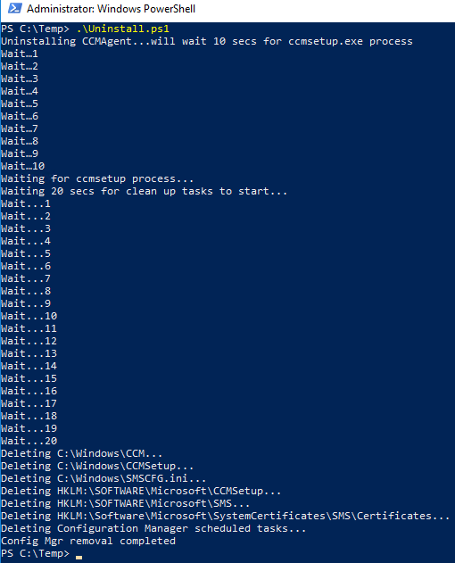

# Automate removal and cleanup of ConfigMgr client

Customers wants to automate the removal and clean up of Config Mgr agent via PowerShell.

**NOTE: Do NOT run this script on a device that has any other ConfigMgr Site System roles installed.**

This code uninstalls the agent, deletes the folders:

- C:\Windows\CCM
- C:\Windows\CCMSetup
- C:\Windows\CCMCache
- C:\Windows\CCMTemp
- C:\Windows\SMSCFG.ini
- C:\Windows\SMS*.mif
- HKLM:\SOFTWARE\Microsoft\CCMSetup
- HKLM:\SOFTWARE\Microsoft\SMS
- HKLM:\Software\Microsoft\SystemCertificates\SMS\Certificates
- Any scheduled task within Microsoft\Configuration Manager

This is how it would like upon success



```powershell
<#
    .NOTES
    ===========================================================================
     Created on:   Feb/12/2020
     Version :     1.0, Initial Release
     Created by:   Vinicio Oses
     Organization: System Center Configuration Manager Costa Rica
     Filename:     Wipe-ConfigMgrAgent.ps1
     ===========================================================================
     .DESCRIPTION
             Automate the removal and clean up of Config Mgr agent via PowerShell.
             NOTE: Do NOT run this script on a device that has any other ConfigMgr Site System roles installed.
             This code uninstalls the agent, deletes the folders C:\Windows\CCM, C:\Windows\CCMSetup, C:\Windows\CCMCache, C:\Windows\CCMTemp, 
             the files C:\Windows\SMSCFG.ini, C:\Windows\SMS*.mif, the registry keys HKLM:\SOFTWARE\Microsoft\CCMSetup, 
             HKLM:\SOFTWARE\Microsoft\SMS, HKLM:\Software\Microsoft\SystemCertificates\SMS\Certificates and finally, any scheduled task within Microsoft\Configuration Manager
#>

$currentPrincipal = New-Object Security.Principal.WindowsPrincipal([Security.Principal.WindowsIdentity]::GetCurrent())
If ( ( $currentPrincipal.IsInRole([Security.Principal.WindowsBuiltInRole]::Administrator) ) -eq $true ) {
If ( Test-Path -Path C:\Windows\CCMSetup\ccmsetup.exe -ErrorAction SilentlyContinue ) {
    Write-Host "Uninstalling CCMAgent...will wait 10 secs for ccmsetup.exe process"
    C:\Windows\CCMSetup\ccmsetup.exe /uninstall
    For ($i = 1; $i -le 10; $i++ ) { Write-Host "Wait…"; start-sleep 1 }
    Write-Host "Waiting for ccmsetup process..."
    Wait-Process -Name ccmsetup }
else { Write-Host "CcmSetup.exe not found, needs manual intervention"; $Host.UI.RawUI.ReadKey("NoEcho,IncludeKeyUp") > $null; exit }
Write-Host "Waiting 20 secs for clean up tasks to start..."
For ($i = 1; $i -le 20; $i++ ) { Write-Host "Wait..."; start-sleep 1 }
If ( Test-Path -Path C:\Windows\CCM -ErrorAction SilentlyContinue ) { Write-Host "Deleting C:\Windows\CCM..."; Remove-Item -Path C:\Windows\CCM -Recurse -Force -ErrorAction SilentlyContinue -Exclude C:\Windows\CCM\ScriptStore }
If ( Test-Path -Path C:\Windows\CCMSetup -ErrorAction SilentlyContinue ) { Write-Host "Deleting C:\Windows\CCMSetup..."; Remove-Item -Path C:\Windows\CCMSetup -Recurse -Force -ErrorAction SilentlyContinue }
If ( Test-Path -Path C:\Windows\CCMCache -ErrorAction SilentlyContinue ) { Write-Host "Deleting C:\Windows\CCMCache..."; Remove-Item -Path C:\Windows\CCMCache -Recurse -Force -ErrorAction SilentlyContinue }
If ( Test-Path -Path C:\Windows\CcmTemp -ErrorAction SilentlyContinue ) { Write-Host "Deleting C:\Windows\CCMTemp..."; Remove-Item -Path C:\Windows\CcmTemp -Recurse -Force -ErrorAction SilentlyContinue }
If ( Test-Path -Path C:\Windows\SMSCFG.ini -ErrorAction SilentlyContinue ) { Write-Host "Deleting C:\Windows\SMSCFG.ini..."; Remove-Item -Path C:\Windows\SMSCFG.ini -Force -ErrorAction SilentlyContinue }
$MIF = (Get-ChildItem -Path C:\Windows\ -Filter SMS*.mif).FullName
If ( $MIF -ne $null ) { Write-Host "Deleting C:\Windows\SMS*.MIF files..."; Remove-Item -Path $MIF -Force -ErrorAction SilentlyContinue }
If ( Test-Path -Path HKLM:\SOFTWARE\Microsoft\CCMSetup -ErrorAction SilentlyContinue ) { Write-Host "Deleting HKLM:\SOFTWARE\Microsoft\CCMSetup..."; Remove-Item -Path HKLM:\SOFTWARE\Microsoft\CCMSetup -Recurse -Force -ErrorAction SilentlyContinue }
If ( Test-Path -Path HKLM:\SOFTWARE\Microsoft\SMS -ErrorAction SilentlyContinue ) { Write-Host "Deleting HKLM:\SOFTWARE\Microsoft\SMS..."; Remove-Item -Path HKLM:\SOFTWARE\Microsoft\SMS -Recurse -Force -ErrorAction SilentlyContinue }
If ( Test-Path -Path HKLM:\Software\Microsoft\SystemCertificates\SMS\Certificates -ErrorAction SilentlyContinue ) { Write-Host "Deleting HKLM:\Software\Microsoft\SystemCertificates\SMS\Certificates..."; Remove-Item -Path HKLM:\Software\Microsoft\SystemCertificates\SMS\Certificates -Recurse -Force }
If ( Get-ItemProperty "HKLM:\SOFTWARE\Microsoft\Windows NT\CurrentVersion\Schedule\TaskCache\Tree\Microsoft\Configuration Manager" ) {
    Write-Host "Deleting Configuration Manager scheduled tasks...";
    $TS = New-Object -ComObject Schedule.Service
    $TS.Connect($env:COMPUTERNAME)
    $TaskFolder = $TS.GetFolder("\Microsoft\Configuration Manager")
    $Tasks = $TaskFolder.GetTasks(1)
    foreach($Task in $Tasks){
    $TaskFolder.DeleteTask($Task.Name,0) } } } else { Write-Host "PowerShell needs to be ran as admin"; $Host.UI.RawUI.ReadKey("NoEcho,IncludeKeyUp") > $null; exit }
```
